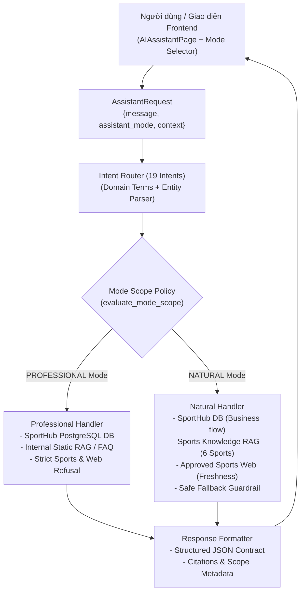

# Kiến trúc Hệ thống AI — SportHub AI Assistant (CP-11B)

## I. Tuyên bố Kiến trúc Chính thức (Official Architecture Statement)

> **Kiến trúc chính thức**:
> **Deterministic Rule-based Pipeline with Guardrailed RAG, Scoped LLM Structured Output & Scikit-Learn Demand Prediction**
>
> Hệ thống **không** sử dụng kiến trúc Autonomous Agent hay ReAct vòng lặp mở để đảm bảo:
> 1. Tính tiền định (Determinism) và kiểm soát hoàn toàn phạm vi truy cập dữ liệu.
> 2. Độ trễ thấp, không lặp prompt không kiểm soát.
> 3. Tuyệt đối không hallucination đối với dữ liệu tài chính, đặt sân và thông tin thực tế.

---

## II. Sơ đồ Khối Kiến trúc Tổng thể (System Block Diagram)



---

## III. Ma trận Phân quyền Nguồn dữ liệu theo Chế độ (Mode Scope Policy Matrix)

| Nguồn dữ liệu (Data Source) | NATURAL Mode | PROFESSIONAL Mode |
| :--- | :---: | :---: |
| **SportHub DB (PostgreSQL)** (Sân, Slot, Giá, Đơn đặt, Người dùng) | ✅ Được phép | ✅ Được phép |
| **Internal Static RAG** (Cẩm nang SportHub, Hướng dẫn chủ sân) | ✅ Được phép | ✅ Được phép |
| **Sports Knowledge RAG** (6 môn: Bóng đá, Cầu lông, Pickleball, Tennis, Bóng rổ, Bóng chuyền) | ✅ Được phép | ❌ **Bị chặn tuyệt đối** *(Controlled Refusal)* |
| **Approved Sports Web** (vff.org.vn, baothainguyen.vn, thethao247.vn...) | ✅ Khi cần cập nhật/freshness | ❌ **Bị chặn tuyệt đối** |
| **External General Web** (Google, Wikipedia...) | ❌ Bị chặn | ❌ Bị chặn |

---

## IV. Các Phân hệ Cốt lõi

### 1. Intent Router & Multi-level Priority Routing
Phân loại tiền định dựa trên thực thể, đại từ, hành động và ngữ cảnh đa lượt:
- **Priority Routing Order**:
  1. Safety / Abusive / Nonsense Detection (`ABUSIVE`, `NONSENSE`)
  2. Natural Conversational Chit-chat (`GREETING`, `AI_IDENTITY`, `AI_CAPABILITY`, `THANKS`, `GOODBYE`, `CASUAL`)
  3. SportHub Business & Operations (`SEARCH_VENUE`, `RECOMMEND_VENUE`, `CHECK_AVAILABILITY`, `RECOMMEND_SLOT`, `GET_VENUE_DETAIL`, `CREATE_BOOKING`, `GET_BOOKING`, `CANCEL_BOOKING`, `RESCHEDULE_BOOKING`, `PAYMENT_SUPPORT`, `ACCOUNT_SUPPORT`, `PARTNER_APPLICATION_SUPPORT`, `OCCUPANCY_INSIGHT`, `GET_PRODUCTS`, `SYSTEM_GUIDE`, `FOLLOW_UP`)
  4. Sports Knowledge & Real-world Information (`SPORTS_KNOWLEDGE`)
  5. Fallback & Clarification (`UNCLEAR`, `OUT_OF_SCOPE`)

### 2. Context & Natural Sports Entity Understanding (`SportsContextResolver`)
- **Chuẩn hóa số từ chữ sang số**: Hỗ trợ đọc hiểu số áo bằng chữ hoặc chữ số (`anh bảy` $\leftrightarrow$ `anh 7`, `anh mười` $\leftrightarrow$ `anh 10`, `anh chín` $\leftrightarrow$ `anh 9`...).
- **Multi-sport Slang & Nickname Registry**: Hỗ trợ nhận diện biệt danh thân mật trên 6 môn thể thao (Bóng đá, Tennis, Cầu lông, Bóng rổ, Bóng chuyền, Pickleball).
- **Phân giải đa lượt (Context-driven Follow-up)**: Tự động kế thừa môn thể thao và đối tượng từ lượt hội thoại trước để phân giải chính xác (ví dụ: turn 1 hỏi *"Anh 7 trong bóng đá là ai?"* $\rightarrow$ turn 2 hỏi *"Còn anh 10 là ai?"* $\rightarrow$ suy luận `Lionel Messi`).
- **Xử lý có điều kiện khi thiếu context**: Khi người dùng hỏi câu độc lập thiếu context (*"anh 7 là ai?"*), trả lời có điều kiện và giải thích ngữ cảnh thể thao phổ biến nhất.
- **Xử lý meme / trào lưu hài hước**: Hiểu hóm hỉnh các câu đùa (*"đấng maguire"*, *"anh 7 đi bộ vuốt tóc"*, *"lakaka"*) mà không biến meme thành sự thật.

### 3. Web Source Preview Panel (WP-01 → WP-06)
- **Tách biệt luồng UI**: Chatbot bên trái giữ nguyên, Web Preview Panel hiển thị cố định ở bên phải.
- **Iframe & Fallback UX**: Ưu tiên nhúng iframe khi website cho phép; tự động hiển thị fallback chuyên nghiệp có nút "Mở link" (new tab) và "Copy URL" (kèm toast feedback) khi website chặn iframe hoặc lỗi mạng.
- **Tương tác Nguồn (Citation Linkage)**: Click vào bất kỳ source nào trong câu trả lời AI sẽ ngay lập tức đồng bộ và chuyển đổi nội dung preview panel sang source đó.

### 4. Auto-Update Knowledge Pipeline
```
Approved Sports Web 
    ──> Fact Extraction 
    ──> Schema & Reliability Validation 
    ──> KnowledgeRepository (Idempotent Update) 
    ──> Incremental Re-index (KnowledgeRetriever) 
    ──> Sports RAG (Natural Mode)
```
- **Idempotency**: Kiểm tra hash nội dung tránh duplicate bản ghi.
- **Incremental Index**: Chỉ re-index các bản ghi/chunk thay đổi trong bộ nhớ, không rebuild toàn bộ cơ sở dữ liệu tri thức.
- **Trigger**: Hỗ trợ kích hoạt nền qua background worker và endpoint quản trị bảo vệ (`POST /ai/knowledge/update`).

### 5. RAG Guardrail & Safe Grounding
- **Sufficiency & Freshness Gate**: Đánh giá độ tin cậy và ngày cập nhật của tri thức nội bộ trước khi kích hoạt web search.
- **Evidence-grounded Citations**: Mọi câu trả lời factual thể thao đều kèm theo nguồn (`source_name`, `source_url`, `collected_at`).
- **Safe Fallback**: Khi không có bằng chứng xác thực, trả về thông báo kiểm soát chuẩn hóa, loại bỏ hoàn toàn hiện tượng sinh thông tin ảo (hallucination).

### 6. Mode Context Isolation
- Khi chuyển từ `NATURAL` sang `PROFESSIONAL`: Ngữ cảnh thực thể thể thao (`sports_entity`, `sports_entities`) và intent thể thao của lượt trước được lọc sạch (`_sanitize_context_for_mode`).
- Khi chuyển từ `PROFESSIONAL` sang `NATURAL`: Ngữ cảnh kinh doanh được giữ nguyên đồng thời kích hoạt lại khả năng tra cứu tri thức thể thao.

---

## V. Kết quả Đánh giá Thực nghiệm (Evaluation Results)

- **Bộ Kiểm thử Tự nhiên & Thực thể Thể thao (`test_ai_natural_context_entity.py` & `test_ai_natural_conversation.py`)**: **24/24 test methods PASSED (64+ subtests passed)**.
- **Scenario Harness (`mode_evaluation_dataset.json`)**: **31/31 scenarios PASSED (100.0%)**.
- **Bộ Kiểm thử Toàn diện**: **100% tests PASSED**, 0 failures, 0 regressions.
- **Độ tin cậy**: Đáp ứng 100% các tiêu chuẩn về an toàn thông tin, phân quyền chế độ, và tính toàn vẹn dữ liệu.
