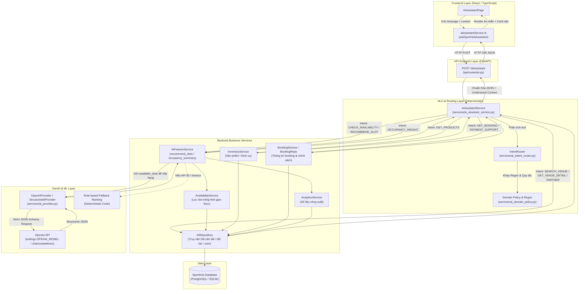

# Báo Cáo Phân Tích Kiến Trúc & Cơ Chế Hoạt Động Của Trợ Lý AI (SportHub AI Assistant)

> **Ngày lập báo cáo:** 02/09/2026  
> **Phạm vi kiểm tra:** Hệ thống Trợ lý AI (`AIAssistantService`, `IntentRouter`, `AIFeatureService`, `OpenAIProvider`, `AIRepository`, `Frontend/src/services/aiAssistantService.ts`).  
> **Mục tiêu:** Phân tích chính xác 100% theo source code hiện có, xác định rõ vai trò của LLM/GenAI, Intent Router, Context Memory và bản chất kiến trúc.

---

## 1. Sử Dụng GenAI / LLM Trong Hệ Thống

GenAI/LLM được đóng gói qua adapter [`OpenAIProvider`](file:///c:/Users/MY%20PC/Documents/AI/SportHub%20AI/Backend/app/services/ai_provider.py#L35-L132) (alias: `StructuredAIProvider`), kết nối trực tiếp đến endpoint OpenAI Chat Completions (`settings.OPENAI_MODEL`) với chế độ **Strict JSON Schema** (`response_format={'type': 'json_schema', 'strict': True}`).

LLM **KHÔNG** tham gia vào việc nhận diện câu hỏi hay trò chuyện tự do trực tiếp với người dùng. LLM chỉ được kích hoạt tại **3 tác vụ chuyên biệt, đóng khung dữ liệu**:

1. **Xếp hạng slot trống & viết lý do (`task='rank_available_slots'`)**:
   - **Vị trí:** [`AIFeatureService.recommend_slots`](file:///c:/Users/MY%20PC/Documents/AI/SportHub%20AI/Backend/app/services/ai_feature_service.py#L70-L92)
   - **Cơ chế:** Backend truy vấn database để lọc ra danh sách các cặp sân/slot **thực sự còn trống** (`available_slots`), sau đó gửi kèm nhu cầu khách hàng vào prompt để LLM chọn tối đa 3 slot phù hợp nhất và viết lý do (`reason`). Nếu LLM trả về slot không hợp lệ hoặc xảy ra lỗi/timeout, backend tự động chuyển sang giải thuật sắp xếp an toàn bằng code thuần (Fallback).
2. **Tóm tắt công suất & gợi ý khuyến mãi (`task='summarize_occupancy_and_suggest_promotions'`)**:
   - **Vị trí:** [`AIFeatureService.occupancy_summary`](file:///c:/Users/MY%20PC/Documents/AI/SportHub%20AI/Backend/app/services/ai_feature_service.py#L254-L285)
   - **Cơ chế:** Nhận bảng thống kê số liệu công suất đã tính toán từ [`AnalyticsService`](file:///c:/Users/MY%20PC/Documents/AI/SportHub%20AI/Backend/app/services/analytics_service.py), yêu cầu LLM viết nhận định định tính (không được tự sửa số liệu) và đề xuất ý tưởng ưu đãi cho các khung giờ thấp điểm (`low_demand_hours`).
3. **Sinh lời chào/kết tin nhắn booking (`task='write_booking_message_copy'`)**:
   - **Vị trí:** [`BookingMessageService.generate`](file:///c:/Users/MY%20PC/Documents/AI/SportHub%20AI/Backend/app/services/booking_message_service.py#L40-L58)
   - **Cơ chế:** Các sự thật nghiệp vụ (mã đặt, số tiền, cọc, ngày giờ, trạng thái) do backend khóa cứng (`facts`), LLM chỉ được phép sinh câu mở đầu (`lead`) và lời kết (`closing`).

---

## 2. Intent Router & Phân Loại Ý Định (NLU Layer)

### Vị trí mã nguồn
- Bộ định tuyến: [`IntentRouter`](file:///c:/Users/MY%20PC/Documents/AI/SportHub%20AI/Backend/app/services/ai_intent_router.py#L105-L247)
- Bộ chính sách miền: [`ai_domain_policy.py`](file:///c:/Users/MY%20PC/Documents/AI/SportHub%20AI/Backend/app/services/ai_domain_policy.py)
- Bộ điều phối thực thi: [`AIAssistantService.ask`](file:///c:/Users/MY%20PC/Documents/AI/SportHub%20AI/Backend/app/services/ai_assistant_service.py#L74-L234)

### Danh sách 19 Intents (`AssistantIntent`)
| Nhóm Intent | Tên Intent | Chức năng nghiệp vụ |
|---|---|---|
| **Tìm kiếm & Đặt sân** | `SEARCH_VENUE` | Tìm sân/cơ sở theo môn thể thao, vị trí |
| | `RECOMMEND_VENUE` | Đề xuất sân tốt nhất / phù hợp |
| | `CHECK_AVAILABILITY` | Kiểm tra lịch trống của sân |
| | `RECOMMEND_SLOT` | Gợi ý khung giờ còn trống tối ưu |
| | `CREATE_BOOKING` | Hướng dẫn tạo booking / xác nhận đặt |
| | `FOLLOW_UP` | Câu hỏi tiếp nối (chọn sân 1, xem sân khác, đổi ngày...) |
| **Thông tin & Tiện ích** | `GET_VENUE_DETAIL` | Tra cứu địa chỉ, tiện ích, chính sách của sân |
| | `GET_PRODUCTS` | Tra cứu sản phẩm/dịch vụ phụ trợ (thuê vợt, nước...) |
| | `SYSTEM_GUIDE` | Hướng dẫn sử dụng các chức năng hệ thống |
| **Quản lý & Nghiệp vụ** | `GET_BOOKING` | Tra cứu trạng thái booking theo mã |
| | `CANCEL_BOOKING` | Hướng dẫn & kiểm tra điều kiện hủy booking |
| | `RESCHEDULE_BOOKING`| Hướng dẫn & kiểm tra điều kiện dời lịch |
| | `PAYMENT_SUPPORT` | Tra cứu thanh toán, đặt cọc, hoàn tiền, doanh thu |
| | `ACCOUNT_SUPPORT` | Tra cứu hồ sơ cá nhân, số lượng tài khoản |
| | `PARTNER_APPLICATION_SUPPORT` | Hướng dẫn & tra cứu trạng thái hồ sơ đối tác chủ sân |
| | `OCCUPANCY_INSIGHT` | Phân tích công suất giờ cao/thấp điểm (chủ sân) |
| **Điều hướng & Kiểm soát**| `GREETING` | Chào hỏi |
| | `UNCLEAR` | Yêu cầu mơ hồ, thiếu thông tin |
| | `OUT_OF_SCOPE` | Câu hỏi ngoài phạm vi nghiệp vụ SportHub |

### Các Entities Trích Xuất (`IntentEntities`)
- `sport_type`: Môn thể thao (`bóng đá`, `cầu lông`, `pickleball`, `tennis`, `bóng rổ`, `bóng chuyền`).
- `court_type`: Loại sân / sức chứa (`5 người`, `7 người`, `sân đơn`, `sân đôi`, `trong nhà`, `ngoài trời`).
- `venue_name`: Tên cơ sở / sân cụ thể.
- `location`: Khu vực / quận huyện / địa chỉ.
- `date`: Ngày đặt (nhận diện `hôm nay`, `ngày mai`, `thứ bảy`, `2026-09-02`,...).
- `start_time`, `end_time`: Giờ bắt đầu / kết thúc.
- `preferred_time`: Buổi trong ngày (`morning`, `afternoon`, `evening`).
- `max_price`: Mức giá tối đa (xử lý đơn vị `k`, `nghìn`, `triệu`, `đ`).
- `number_of_players`: Số người chơi.
- `booking_code`: Mã đặt sân định dạng `SH-XXXXXX`.

### Cơ chế định tuyến
Sử dụng **Giải thuật Rule-based NLU / Heuristics thuần túy**:
1. Chuẩn hóa tiếng Việt không dấu (`normalize_text`).
2. Khớp từ khóa chặn phạm vi (`OUT_OF_SCOPE_TERMS`).
3. Khớp Regex & Từ điển nhận diện ngày/giờ (`_times`, `_date`), môn thể thao (`SPORT_ALIASES`), mức giá (`_price`), mã booking (`_booking_code`).
4. Chấm điểm độ tin cậy (`confidence`). **Hoàn toàn không dùng LLM để phân loại intent.**

---

## 3. Xử Lý Ngữ Cảnh & Bộ Nhớ Hội Thoại (Context / Memory)

1. **Backend Stateless**:
   - Backend không lưu phiên chat (session) trong RAM, Redis hay Database.
   - Endpoint [`POST /ai/assistant`](file:///c:/Users/MY%20PC/Documents/AI/SportHub%20AI/Backend/app/api/routes/ai.py#L69-L88) nhận payload gồm `{ message, context_field_id, context }`.
2. **Client-driven Context State**:
   - Phía Frontend ([`AIAssistantPage.tsx`](file:///c:/Users/MY%20PC/Documents/AI/SportHub%20AI/Frontend/src/pages/AIAssistantPage.tsx)) duy trì state `understood` và `context` qua từng lượt hội thoại.
   - Khi gửi tin nhắn mới, Frontend đính kèm context hiện tại (chứa `sport_type`, `location`, `booking_date`, `field_id`, `result_field_ids`, `reference_price`, `last_intent`...).
3. **Hợp nhất & Đặt lại ngữ cảnh (Context Merge & Reset)**:
   - [`_merge_context`](file:///c:/Users/MY%20PC/Documents/AI/SportHub%20AI/Backend/app/services/ai_assistant_service.py#L705-L730): Bổ sung các thông tin còn thiếu trong câu hỏi mới từ context cũ.
   - [`_starts_new_request`](file:///c:/Users/MY%20PC/Documents/AI/SportHub%20AI/Backend/app/services/ai_intent_router.py#L324-L333): Khi người dùng đổi sang tìm kiếm môn khác, vị trí khác hoặc bắt đầu yêu cầu mới, hệ thống kích hoạt `context_reset = True` để xóa bỏ context cũ.
   - Tham chiếu vị trí (`_resolve_result_reference`): Hiểu các câu hỏi tiếp nối như *"sân đầu tiên"*, *"lựa chọn 2"*, *"sân rẻ hơn"* bằng cách tra ngược danh sách `result_field_ids` trong context.

---

## 4. Xác Định Bản Chất: Có AI Agent Thực Sự Không?

> **KẾT LUẬN: KHÔNG CÓ AI AGENT TỰ TRỊ (NO AUTONOMOUS AGENT).**

- **Không có** ReAct loop hay vòng lặp suy luận (`Thought -> Action -> Observation`).
- **Không có** Framework Agentic (LangChain, LlamaIndex, AutoGen, CrewAI).
- **Không có** LLM Tool Calling tự động: LLM không tự quyết định khi nào gọi hàm hay chọn dữ liệu.
- Hệ thống hoạt động theo mô hình **Deterministic Rule-based Workflow**: Toàn bộ luồng điều khiển (routing, truy vấn database, phân quyền, kiểm tra tính khả dụng, định dạng phản hồi) được thực thi 100% bằng code Python truyền thống. LLM chỉ đóng vai trò là một dịch vụ phụ trợ (worker) để xếp hạng dữ liệu đã chuẩn bị sẵn và sinh văn bản có cấu trúc kiểm soát.

---

## 5. Các Backend Business Services & Repositories Được Tích Hợp

| Service / Thành phần | File mã nguồn | Chức năng trong hệ thống AI |
|---|---|---|
| [`AvailabilityService`](file:///c:/Users/MY%20PC/Documents/AI/SportHub%20AI/Backend/app/services/availability_service.py) | `availability_service.py` | Kiểm tra lịch trống thực tế, ghép chuỗi slot liên tiếp, loại trừ slot đã đặt/khóa |
| [`AIRepository`](file:///c:/Users/MY%20PC/Documents/AI/SportHub%20AI/Backend/app/repositories/ai_repository.py) | `ai_repository.py` | Truy vấn cơ sở dữ liệu sân bãi, hồ sơ đối tác, doanh thu, đếm số lượng cơ sở |
| [`AIFeatureService`](file:///c:/Users/MY%20PC/Documents/AI/SportHub%20AI/Backend/app/services/ai_feature_service.py) | `ai_feature_service.py` | Điều phối xếp hạng slot trống và tổng hợp báo cáo công suất |
| [`CustomerRecommendationService`](file:///c:/Users/MY%20PC/Documents/AI/SportHub%20AI/Backend/app/services/customer_recommendation_service.py) | `customer_recommendation_service.py` | Đề xuất sân cá nhân hóa dựa trên lịch sử đặt sân của khách hàng |
| [`InventoryService`](file:///c:/Users/MY%20PC/Documents/AI/SportHub%20AI/Backend/app/services/inventory_service.py) | `inventory_service.py` | Tra cứu sản phẩm/dịch vụ phụ trợ còn hàng (nước uống, thuê vợt,...) |
| [`BookingService`](file:///c:/Users/MY%20PC/Documents/AI/SportHub%20AI/Backend/app/services/booking_service.py) & Repo | `booking_service.py` | Tra cứu thông tin booking, chính sách hủy, tiền cọc |
| [`AnalyticsService`](file:///c:/Users/MY%20PC/Documents/AI/SportHub%20AI/Backend/app/services/analytics_service.py) | `analytics_service.py` | Tính toán tỷ lệ lấp đầy, số giờ khai thác, giờ cao điểm/thấp điểm |
| [`DemandPredictionService`](file:///c:/Users/MY%20PC/Documents/AI/SportHub%20AI/Backend/app/ai/inference/prediction_service.py) | `prediction_service.py` | Mô hình Scikit-Learn (Random Forest) dự báo nhu cầu LOW / MEDIUM / HIGH |
| [`OpenAIProvider`](file:///c:/Users/MY%20PC/Documents/AI/SportHub%20AI/Backend/app/services/ai_provider.py) | `ai_provider.py` | Adapter kết nối OpenAI API qua HTTP với Strict JSON Schema |

---

## 6. Sơ Đồ Kiến Trúc & Luồng Xử Lý AI

### Sơ đồ Mermaid (Phản ánh chính xác 100% source code)



---

### Sơ đồ ASCII

```
+-----------------------------------------------------------------------------------+
|                           FRONTEND (React / TypeScript)                           |
|  [AIAssistantPage.tsx]  <====== (Lưu context qua mỗi lượt hội thoại)             |
|          │                                                                        |
|          ▼                                                                        |
|  [askSportHubAssistant] (Frontend API client gửi: message, context_field_id, context)
+-----------------------------------------------------------------------------------+
                                   │ HTTP POST
                                   ▼
+-----------------------------------------------------------------------------------+
|                        FASTAPI ENDPOINT (/ai/assistant)                           |
+-----------------------------------------------------------------------------------+
                                   │
                                   ▼
+-----------------------------------------------------------------------------------+
|                       AIAssistantService (Điều phối chính)                        |
|                                  │                                                |
|                                  ▼                                                |
|        [IntentRouter] ── (Heuristic / Regex / Từ khóa / Bóc tách Entity)          |
|                                  │                                                |
|            ┌─────────────────────┼──────────────────────┬────────────────────┐    |
|            ▼                     ▼                      ▼                    ▼    |
|   [SEARCH_VENUE / DETAIL]  [GET_BOOKING / PAY]   [RECOMMEND_SLOT]   [OCCUPANCY]   |
|            │                     │                      │                    │    |
|            ▼                     ▼                      ▼                    ▼    |
|       AIRepository         BookingService        AIFeatureService    AnalyticsSvc |
|            │                     │                      │                    │    |
|            │                     │             (AvailabilityService)         │    |
|            │                     │                      │                    │    |
|            ▼                     ▼                      ▼                    ▼    |
|   +-----------------------------------------------------------------------------+ |
|   |                        DATABASE (PostgreSQL / SQLite)                       | |
|   +-----------------------------------------------------------------------------+ |
|            │                     │                      │                    │    |
|            │                     │                      ▼                    ▼    |
|            │                     │             +--------------------------------+ |
|            │                     │             |  OpenAIProvider (Structured)   | |
|            │                     │             |  - Task: rank_available_slots  | |
|            │                     │             |  - Task: summarize_occupancy   | |
|            │                     │             |  [Fallback sang Rule-based]    | |
|            │                     │             +--------------------------------+ |
|            │                     │                              │                 |
|            │                     │                              ▼                 |
|            │                     │                     +-----------------+        |
|            │                     │                     |   OpenAI API    |        |
|            │                     │                     +-----------------+        |
|            │                     │                              │                 |
|            └─────────────────────┴──────────────────────────────┘                 |
|                                  │                                                |
|                                  ▼                                                |
|     [_response]: Đóng gói text trả lời + understood context + danh sách sân       |
+-----------------------------------------------------------------------------------+
                                   │ HTTP 200 JSON Response
                                   ▼
                           [Client UI Render]
```

---

## 7. Tổng Kết

1. **SportHub AI có GenAI không?**
   - **Có.** Hệ thống tích hợp OpenAI API (`OpenAIProvider`) nhưng chỉ dùng có kiểm soát thông qua **Strict JSON Schema** cho 3 tác vụ chuyên biệt: xếp hạng slot trống (`rank_available_slots`), viết gợi ý ưu đãi công suất (`summarize_occupancy_and_suggest_promotions`), và sinh lời chào tin nhắn (`write_booking_message_copy`).
2. **Có AI Agent thực sự không?**
   - **Không.** Hệ thống không có Agent tự hành (ReAct / Autonomous Loop / Dynamic Tool Selection). Toàn bộ luồng nghiệp vụ được điều khiển 100% bằng code Python theo kịch bản xác định.
3. **Intent Router đang đóng vai trò gì?**
   - Đóng vai trò là **Bộ phân loại ý định và trích xuất thực thể bằng luật (Rule-based NLU)**. Nó phân tích câu tiếng Việt bằng Regex và từ điển từ khóa, trích xuất thông tin (môn, ngày, giờ, giá, mã booking), quản lý trạng thái context và chuyển hướng tới đúng Backend Service tương ứng.
4. **Kiến trúc hiện tại nên được gọi chính xác là gì?**
   - **"Deterministic Rule-based Pipeline with Guardrailed LLM Structured Output & Scikit-Learn Demand Prediction"** (Hệ thống điều phối đường ống theo luật xác định, kết hợp LLM sinh dữ liệu có cấu trúc kiểm soát nghiêm ngặt và Machine Learning dự báo nhu cầu).
