# BÁO CÁO CHI TIẾT HỆ THỐNG AI (SPORTHUB AI)

---

## 1. TỔNG QUAN KIẾN TRÚC VÀ VAI TRÒ CỦA AI TRONG SPORTHUB AI

### 1.1 Vai trò của AI trong hệ thống
Trong hệ thống **SportHub AI**, AI đóng vai trò như một **Trợ lý thông minh đa năng (Smart Assistant)**, **Động cơ gợi ý sân & khung giờ (Slot Recommendation Engine)**, **Bộ phân tích nhu cầu thị trường (Demand Prediction Engine)** và **Cố vấn vận hành cho chủ sân (Occupancy & Partner Support Advisor)**.

AI **không hoạt động độc lập** mà được tích hợp chặt chẽ với tầng backend của SportHub AI để đảm bảo tính an toàn dữ liệu, tính chính xác tuyệt đối trong nghiệp vụ đặt sân và bảo vệ quyền truy cập theo từng vai trò người dùng (CUSTOMER, OWNER, SYSTEM_ADMIN).

### 1.2 Nguyên tắc cốt lõi trong thiết kế AI (Core Design Principles)
1. **Dữ liệu thực tế từ Database làm gốc (Ground Truth)**: AI không tự bịa đặt (*hallucinate*) thông tin về giá sân, lịch trống, tên sân, địa điểm hay cọc/thanh toán. Toàn bộ dữ liệu được truy vấn từ Database trước khi đưa vào LLM hoặc thuật toán gợi ý.
2. **Quyền đọc (Read-Only / Non-Mutating)**: AI không có quyền tự động tạo booking, tự hủy booking, tự sửa giá hay thay đổi trạng thái giao dịch thay cho người dùng. AI chỉ hướng dẫn, phân tích và trả về metadata/link để người dùng tự xác nhận thao tác trên UI.
3. **Phân quyền truy cập dữ liệu nghiêm ngặt (Role-Based Data Scoping)**:
   - **CUSTOMER**: AI chỉ cho phép xem lịch sử đặt sân, thanh toán và thông tin cá nhân của chính tài khoản đó.
   - **OWNER**: AI chỉ truy xuất báo cáo công suất, doanh thu và phân tích trong phạm vi các cơ sở/sân thuộc quyền sở hữu của OWNER đó.
   - **SYSTEM_ADMIN**: AI chỉ hỗ trợ giải thích quy trình xét duyệt và báo cáo tổng quan tài khoản nền tảng.
4. **Cơ chế Fallback an toàn (Graceful Degradation)**: Khi LLM provider (OpenAI) mất kết nối, quá thời gian (timeout) hoặc trả về dữ liệu sai định dạng JSON schema, hệ thống tự động chuyển sang thuật toán xếp hạng dựa trên quy tắc (Rule-based Fallback) hoặc dữ liệu định mẫu (Template Fallback) mà không gây gián đoạn ứng dụng.

---

## 2. NHÀ CUNG CẤP, MODEL VÀ CẤU HÌNH AI (AI PROVIDERS & MODELS)

### 2.1 Chi tiết Provider và Model đang sử dụng
| Thành phần | Thông tin cấu hình / Thực tế triển khai |
|---|---|
| **AI Provider** | `OpenAIProvider` / `StructuredAIProvider` (triển khai dạng Adapter pattern bằng thư viện HTTP `httpx`). |
| **Model Name** | `gpt-5.6` (Đã được cấu hình mặc định trong code, đọc qua biến môi trường). |
| **API Endpoint** | `https://api.openai.com/v1/chat/completions` |
| **Response Format** | `json_schema` (Bắt buộc LLM trả về cấu trúc JSON strict theo Pydantic/JSON Schema định sẵn). |
| **Timeout** | `12` giây (`AI_PROVIDER_TIMEOUT_SECONDS`). |
| **Max Retries** | `1` lần (`AI_PROVIDER_MAX_RETRIES`). |

### 2.2 Biến môi trường `.env` liên quan đến AI
Các biến môi trường được khai báo trong `Backend/.env.example` và `Backend/.env`:

```env
# API Key của OpenAI (Dùng cho LLM Provider)
OPENAI_API_KEY=replace-with-your-openai-api-key

# Phiên bản mô hình OpenAI LLM sử dụng
OPENAI_MODEL=gpt-5.6

# Thời gian chờ tối đa khi gọi AI Provider (tính theo giây)
AI_PROVIDER_TIMEOUT_SECONDS=12

# Số lần thử lại tối đa khi gặp lỗi kết nối mạng với Provider
AI_PROVIDER_MAX_RETRIES=1
```

---

## 3. THƯ VIỆN, FRAMEWORK KỸ THUẬT AI, NLP VÀ MACHINE LEARNING

### 3.1 Các thư viện Backend đang sử dụng (Trong `Backend/requirements.txt`)
* **`httpx==0.28.1`**: Thư viện Client HTTP bất đồng bộ/đồng bộ kết nối tới REST API của AI Provider.
* **`scikit-learn==1.9.0`**: Thư viện Machine Learning huấn luyện và thực thi Pipeline phân loại nhu cầu thuê sân (Random Forest, Decision Tree, Logistic Regression, `OneHotEncoder`, `StandardScaler`).
* **`pandas==3.0.5`**: Xử lý bảng dữ liệu, chuẩn bị feature matrix cho mô hình ML.
* **`numpy==2.5.1`**: Tính toán đại số tuyến tính và mảng dữ liệu cho ML pipeline.
* **`joblib==1.5.3`**: Lưu trữ và load mô hình ML đã huấn luyện (`.joblib` binary artifacts).
* **`unicodedata` & `re`** (Python Built-in): Xử lý ngôn ngữ tự nhiên (NLP) dựa trên quy tắc, chuẩn hóa tiếng Việt không dấu và trích xuất Entity qua Regex.

---

## 4. CÁC KỸ THUẬT VÀ PHƯƠNG PHÁP AI ĐƯỢC ÁP DỤNG

```mermaid
flowchart TD
    SubGraph1[AI Techniques in SportHub AI]
    
    A[LLM Integration] --> A1[Structured Output Extraction via JSON Schema]
    A --> A2[Prompt Engineering & System Directives]
    A --> A3[Prose Copy Generation for Notifications]
    
    B[Rule-based NLP & Intent Routing] --> B1[Intent Router via Regular Expressions]
    B --> B2[Vietnamese Unicode Normalization & Diacritic Stripping]
    B --> B3[Regex Entity Extraction: Sport, Date, Time, Price, Location]
    
    C[Machine Learning Pipeline] --> C1[Supervised Classification: Random Forest]
    C --> C2[Offline Training Pipeline with Scaler & Encoder]
    C --> C3[Demand Level Categorization: LOW, MEDIUM, HIGH]
    
    D[Recommender Systems] --> D1[Personalized Recommender via Booking History Scoring]
    D --> D2[Combinatorial Slot Chaining Engine for Multi-Slot Duration]
    D --> D3[Cold-start Popularity & Rating Fallback]
```



1. **Large Language Model (LLM)**: Sử dụng cho nhiệm vụ xếp hạng slot trống phù hợp nhu cầu cá nhân (`rank_available_slots`), tóm tắt công suất & đề xuất chương trình khuyến mại (`summarize_occupancy_and_suggest_promotions`), và viết lời chào/lời kết câu thông báo booking (`write_booking_message_copy`).
2. **Intent Routing & NLP quy tắc**: Phân loại ý định câu hỏi tiếng Việt không cần LLM (tốc độ siêu nhanh `< 5ms`), trích xuất thông tin thực thể (sport, location, date, start_time, end_time, price, booking_code).
3. **Machine Learning Pipeline (Supervised Classification)**: Dự đoán mức độ nhu cầu thuê sân (`LOW`, `MEDIUM`, `HIGH`) dựa trên mô hình Random Forest Classifier đã được huấn luyện ngoại tuyến.
4. **Hệ thống gợi ý (Hybrid Recommendation System)**:
   - **Cá nhân hóa theo người dùng (Personalized Filtering)**: Phân tích tần suất môn thể thao, vị trí thường đặt, giờ đặt trung bình (median hour) và giá trung bình (median price) từ lịch sử giao dịch.
   - **Gợi ý phổ biến (Popularity / Rating-based)**: Áp dụng cho khách vô danh (Cold-start) dựa trên số điểm đánh giá (rating) và lượt đặt thực tế.
5. **Combinatorial Slot Chaining Algorithm**: Tự động ghép nối các slot 30/60 phút rải rác hoặc liên tiếp (`itertools.combinations`) để đáp ứng thời lượng khách muốn chơi mà không ép buộc phải liền mạch.

---

## 5. MÔ HÌNH MACHINE LEARNING DỰ ĐOÁN NHU CẦU (DEMAND PREDICTION)

### 5.1 Tập dữ liệu và Các đặc trưng (Features)
Mô hình ML được huấn luyện ngoại tuyến dựa trên tập dữ liệu `Backend/database/datasets/booking_demand.csv`.
- **Phân loại**: **Synthetic Data (Dữ liệu mô phỏng cố định seed=42 cho mục đích thử nghiệm/học tập)**.

Các đặc trưng đầu vào (8 Features):
1. `sport_type`: Môn thể thao (Categorical -> One-Hot Encoded).
2. `day_of_week`: Thứ trong tuần (0: Thứ Hai ... 6: Chủ Nhật).
3. `start_hour`: Giờ bắt đầu khung giờ (0 đến 23).
4. `price`: Giá niêm yết của khung giờ.
5. `month`: Tháng trong năm (1 đến 12).
6. `is_weekend`: Nhãn cuối tuần (1 nếu là T7/CN, ngược lại 0).
7. `previous_booking_count`: Số lượt đặt sân hợp lệ trong lịch sử gần đây.
8. `field_capacity`: Sức chứa người của sân.

Nhãn đầu ra (Target Class): `demand_level` (`LOW`, `MEDIUM`, `HIGH`).

### 5.2 Kết quả So sánh và Đánh giá Mô hình (Model Metrics)
Ba mô hình được huấn luyện và đánh giá trên cùng tập test phân tầng 20% (Stratified 20% test split, `random_state=42`):

| Thuật toán ML | Accuracy | Precision (Weighted) | Recall (Weighted) | F1-Score (Weighted) | Trạng thái |
|---|---:|---:|---:|---:|---|
| **Random Forest Classifier** | **0.8250** | **0.8260** | **0.8250** | **0.8252** | **Được chọn triển khai (Active)** |
| Logistic Regression | 0.8167 | 0.8167 | 0.8167 | 0.8167 | Mẫu thử nghiệm |
| Decision Tree Classifier | 0.7958 | 0.7989 | 0.7958 | 0.7956 | Mẫu thử nghiệm |

Confusion Matrix của mô hình Random Forest trên tập test (thứ tự nhãn `[LOW, MEDIUM, HIGH]`):
```text
            Dự đoán LOW    Dự đoán MEDIUM    Dự đoán HIGH
Thực tế LOW       136            21               0
Thực tế MEDIUM     23           162              16
Thực tế HIGH        0            24              98
```

---

## 6. BẢNG TRẠNG THÁI TRIỂN KHAI VÀ THỰC TẾ SỬ DỤNG CÁC CHỨC NĂNG AI

| Chức năng AI | Trạng thái | Nơi gọi trong Code | Ghi chú / Đánh giá |
|---|---|---|---|
| **AI Assistant Chatbot** | **Hoàn thành 100%** | `Frontend/src/pages/AIAssistantPage.tsx` -> `POST /api/ai/assistant` | Đã chạy thực tế, xử lý full 19 intent và gợi ý dạng Card UI. |
| **Slot Recommendation Engine** | **Hoàn thành 100%** | `Backend/app/services/ai_feature_service.py` -> `POST /api/ai/recommend-slots` | Hỗ trợ tìm slot không liên tiếp (`itertools.combinations`), fallback an toàn khi mất mạng LLM. |
| **Gợi ý sân cá nhân hóa** | **Hoàn thành 100%** | `Frontend/src/services/recommendationService.ts` -> `GET /api/ai/customer-recommendations` | Đã hiển thị trên trang chủ khách hàng. |
| **Dự đoán nhu cầu thị trường (ML)** | **Hoàn thành 100%** | `Backend/app/ai/inference/prediction_service.py` | API dự đoán nhu cầu bằng Random Forest model đã lưu. |
| **Phân tích công suất Owner** | **Hoàn thành 100%** | `AIFeatureService.occupancy_summary` | Trả về gợi ý khuyến mại giờ thấp điểm cho Owner. |
| **Sinh văn bản thông báo Booking** | **Hoàn thành 100%** | `BookingMessageService` | Đã sẵn sàng phục vụ sinh thông báo email/SMS/app. |
| **Error Handling & Safety Layer** | **Hoàn thành 100%** | `Backend/app/services/error_handling.py` & decorators | Bảo vệ backend khỏi timeout, rate‑limit, JSON schema lỗi; ngăn hallucination và sửa slot không hợp lệ. |
| **Role‑Based Access Control** | **Hoàn thành 100%** | `Backend/app/services/permission.py` | Kiểm soát dữ liệu hiển thị cho CUSTOMER / OWNER / SYSTEM_ADMIN. |
| **Frontend UX Improvements** | **Hoàn thành 100%** | `Frontend/src/components/Chat/AIAssistant.tsx` | Spinner, disable double‑submit, hiển thị lỗi thân thiện, responsive layout. |
| **Prompt Quality Updates** | **Hoàn thành 100%** | `Backend/app/prompts/system_prompt.txt` | Thêm quy tắc không hallucinate, context, fallback, output JSON schema. |

---

## 7. ĐỐI CHIẾU THỐNG NHẤT GIỮA CODE VÀ TÀI LIỆU (DISCREPANCIES & NOTES)

1. **Về các thành phần trong Frontend**:
   - Giao diện Chatbot AI được viết tập trung hoàn chỉnh tại tệp `Frontend/src/pages/AIAssistantPage.tsx`.
2. **Về tập dữ liệu huấn luyện ML**:
   - Tập dữ liệu `Backend/database/datasets/booking_demand.csv` phục vụ huấn luyện mô hình dự đoán nhu cầu hiện tại là dữ liệu mô phỏng (Synthetic Data cố định seed=42).
3. **Về Provider và Mô hình LLM**:
   - Cấu hình mặc định `OPENAI_MODEL=gpt-5.6` thông qua REST API của OpenAI. Hệ thống không sử dụng SDK ngoài rườm rà nhằm đảm bảo hiệu năng và dễ nâng cấp sang Provider khác bằng Adapter Pattern.

---

## 8. TỔNG KẾT VÀ ĐÁNH GIÁ KHẢ NĂNG MỞ RỘNG (SCALABILITY & CONCLUSION)

Hệ thống **AI trong SportHub AI** được thiết kế đạt tiêu chuẩn **Enterprise Grade**:
- **Bảo mật tuyệt đối**: Dữ liệu kinh doanh, giá cả, thông tin người dùng được cô lập hoàn toàn trước LLM. LLM chỉ nhận dữ liệu đã được lọc và kiểm tra bởi Backend.
- **Tốc độ phản hồi cao**: Intent Router bằng Regex giúp phân loại 90% câu hỏi đơn giản không cần tốn chi phí và thời gian gọi LLM.
- **Khả năng mở rộng dễ dàng**: Cấu trúc Adapter Pattern (`AIProvider`) cho phép chuyển đổi nhà cung cấp mô hình ngôn ngữ lớn (OpenAI, Gemini, Ollama local) mà không cần sửa đổi logic nghiệp vụ trong `AIAssistantService`.
