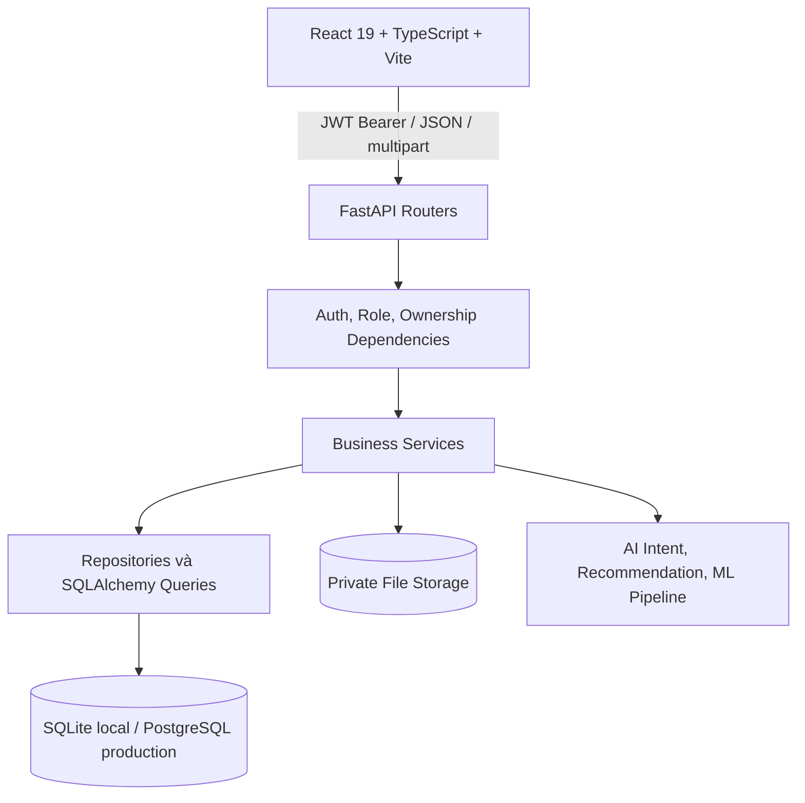
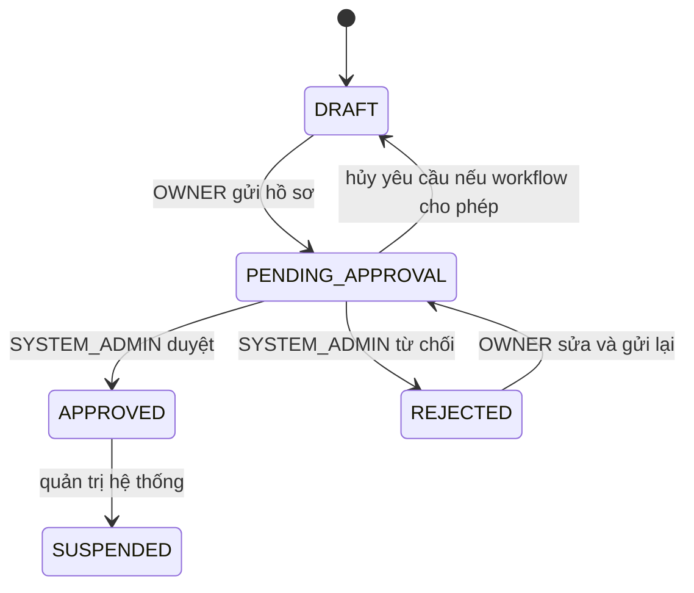
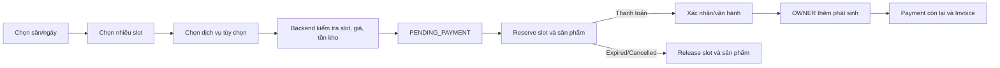

# Kiến trúc SportHub AI

> Cập nhật ngày 16/08/2026.

## Tổng quan



## Frontend

- React 19, TypeScript (`.ts`, `.tsx`), Vite và React Router.
- Tailwind CSS và các component dùng chung trong `Frontend/src/components/common`.
- `AuthContext`, `AuthGuard`, `RoleGuard` bảo vệ điều hướng; backend vẫn là nguồn quyết định quyền cuối cùng.
- Service trong `Frontend/src/services` gọi API thật và gắn access token.
- Các khu vực chính: public, CUSTOMER, OWNER management, SYSTEM_ADMIN, notification và AI assistant.
- Module sản phẩm dùng `productService.ts`; cấu hình nhanh tại sân dùng `FieldServicesModal.tsx`.

## Backend

- Router chỉ nhận/validate request và gọi service.
- Service thực thi state machine, ownership, tính tiền, inventory và audit.
- Repository đóng gói truy vấn booking, payment, dashboard, AI và availability.
- Schema Pydantic kiểm tra request/response.
- SQLAlchemy model lưu dữ liệu nghiệp vụ và quan hệ.

## Vai trò và tenant

- `CUSTOMER`: dữ liệu booking/payment/refund của chính mình.
- `OWNER`: dữ liệu thuộc các facility mình sở hữu.
- `SYSTEM_ADMIN`: quản trị và xét duyệt; không vận hành booking OWNER.
- Không có vai trò MANAGER.
- Backend không dùng `owner_id` frontend gửi để cấp quyền; owner được lấy từ JWT.

## Các cụm dữ liệu chính

```text
User
 ├─ OwnerApplication
 ├─ Notification
 └─ Facility (qua owner_id)
      ├─ FacilityImage
      ├─ FacilityDocument
      ├─ FacilityReviewEvent
      ├─ Field
      │   ├─ TimeSlot
      │   └─ Booking
      │       ├─ BookingSlot
      │       ├─ BookingProductItem
      │       ├─ Payment
      │       └─ Invoice
      └─ FacilityProduct
          ├─ ProductSport
          └─ ProductStockMovement

ProductCatalogItem → gợi ý để OWNER tạo FacilityProduct
```

## State machine cơ sở



- Chỉ `DRAFT` được xóa bằng API xóa bản nháp.
- Chỉ `APPROVED` được công khai, nhận booking và tạo dữ liệu vận hành.
- Giấy tờ/ảnh private được truy cập qua endpoint có quyền.

## Booking, sản phẩm và thanh toán



- `booking_slots` lưu snapshot từng khung giờ.
- `booking_product_items` lưu snapshot tên, loại, đơn vị, số lượng và giá.
- `court_amount`, `service_amount`, `total_amount` được tách riêng.
- Deposit chỉ tính trên `court_amount`; backend không tin tổng tiền frontend.
- Inventory dùng stock/reserved/available và lịch sử movement.
- Sản phẩm có lịch sử được archive thay vì hard delete.

## Catalog và cấu hình dịch vụ

- `product_catalog_items` chứa 47 mẫu theo môn và dùng chung.
- Seed idempotent theo `catalog_key`, dùng chung cơ chế seed dự án.
- OWNER chủ động import; catalog không tự tạo sản phẩm cho mọi facility.
- Cấu hình thực tế nằm ở `facility_products` và `product_sports`.
- Nhiều court cùng facility/sport dùng chung cấu hình, tránh dữ liệu lặp.

## AI

- Intent router phân loại câu hỏi và trích entity.
- Domain policy chặn câu hỏi ngoài phạm vi hoặc mutation không được phép.
- Repository/service áp lại owner/customer scope trước khi đọc dữ liệu.
- Giá và tồn kho sản phẩm lấy từ database thực tế.
- Demand prediction dùng pipeline/metrics lưu sẵn; không train model trong request.
- Provider ngoài phụ thuộc environment và có fallback an toàn.

## Tính toàn vẹn và bảo mật

- Bcrypt password; JWT access/refresh và session version.
- Kiểm tra overlap và unique constraint bảo vệ slot đang mở.
- Transaction/row locking được dùng cho cạnh tranh booking/inventory khi database hỗ trợ.
- Payment không vượt tổng booking; snapshot bảo vệ lịch sử trước thay đổi giá.
- Upload kiểm tra MIME, kích thước, hash, tên lưu an toàn và private path.
- CORS, secret, database URL, seed và provider config đọc từ environment.
- Audit log ghi các mutation quan trọng.

## Migration và seed

- `Base.metadata.create_all` tạo bảng còn thiếu trong môi trường phù hợp.
- Startup migration nâng cấp schema legacy theo hướng tương thích.
- Demo seed bật/tắt bằng environment và idempotent.
- Catalog seed vẫn chạy khi tắt tài khoản demo để OWNER có catalog sử dụng.
