# Thiet ke co so du lieu SportHub AI

Tai lieu doi chieu model SQLAlchemy, schema Pydantic, migration, seed va SQLite local ngay 21/08/2026. ORM co **26 bang**; DB local co **29 bang** do con 3 bang legacy.

## 1. Danh sach toan bo bang

| Bang | Muc dich |
|---|---|
| `audit_logs` | Audit |
| `booking_activities` | Lich su booking |
| `booking_complaints` | Khieu nai |
| `booking_product_items` | San pham booking |
| `booking_slots` | Slot cua booking |
| `bookings` | Phieu dat san |
| `facilities` | Co so the thao |
| `facility_images` | Anh co so |
| `facility_product_sports` | San pham-mon |
| `facility_products` | San pham co so |
| `facility_review_events` | Lich su duyet |
| `facility_verification_documents` | Ho so xac minh |
| `field_blocks` | Khoa lich |
| `field_maintenances` | Bao tri |
| `fields` | San the thao |
| `invoices` | Hoa don |
| `notifications` | Thong bao |
| `owner_applications` | Don doi tac |
| `payments` | Thanh toan |
| `product_catalog_items` | Catalog san pham |
| `product_stock_movements` | Lich su kho |
| `refund_requests` | Hoan tien |
| `reviews` | Danh gia |
| `time_slots` | Khung gio/gia |
| `user_favorite_fields` | San yeu thich |
| `users` | Tai khoan/role |
| `facility_documents` | Bang tai lieu cu ngoai ORM |
| `owner_application_document_archive` | Archive don cu do migration tao |
| `user_permissions` | Bang quyen cu ngoai ORM |

## 2. Chi tiet tung bang

### 2.1. `product_catalog_items` - Catalog san pham

| Cot | Kieu | Null | PK / Unique / FK | Default |
|---|---|---|---|---|
| `id` | `INTEGER` | NOT NULL | PK | `-` |
| `catalog_key` | `VARCHAR(120)` | NOT NULL | UNIQUE | `-` |
| `sport_name` | `VARCHAR(80)` | NOT NULL | - | `-` |
| `name` | `VARCHAR(160)` | NOT NULL | - | `-` |
| `product_type` | `VARCHAR(20)` | NOT NULL | - | `-` |
| `unit` | `VARCHAR(50)` | NOT NULL | - | `-` |
| `track_inventory` | `BOOLEAN` | NOT NULL | - | `True` |
| `is_active` | `BOOLEAN` | NOT NULL | - | `True` |
| `sort_order` | `INTEGER` | NOT NULL | - | `0` |
| `created_at` | `DATETIME` | NOT NULL | - | `UTC now / Python callable` |
| `updated_at` | `DATETIME` | NOT NULL | - | `UTC now / Python callable` |

### 2.2. `users` - Tai khoan/role

| Cot | Kieu | Null | PK / Unique / FK | Default |
|---|---|---|---|---|
| `id` | `INTEGER` | NOT NULL | PK | `-` |
| `full_name` | `VARCHAR(120)` | NOT NULL | - | `-` |
| `email` | `VARCHAR(255)` | NOT NULL | UNIQUE | `-` |
| `phone` | `VARCHAR(20)` | NULL | UNIQUE | `-` |
| `avatar_url` | `VARCHAR(500)` | NULL | - | `-` |
| `hashed_password` | `VARCHAR(255)` | NOT NULL | - | `-` |
| `role` | `VARCHAR(20)` | NOT NULL | - | `CUSTOMER` |
| `is_active` | `BOOLEAN` | NOT NULL | - | `True` |
| `session_version` | `INTEGER` | NOT NULL | - | `server: 0` |
| `created_at` | `DATETIME` | NOT NULL | - | `UTC now / Python callable` |
| `updated_at` | `DATETIME` | NOT NULL | - | `UTC now / Python callable` |

### 2.3. `audit_logs` - Audit

| Cot | Kieu | Null | PK / Unique / FK | Default |
|---|---|---|---|---|
| `id` | `INTEGER` | NOT NULL | PK | `-` |
| `owner_id` | `INTEGER` | NULL | FK -> `users.id`; ON DELETE SET NULL | `-` |
| `actor_id` | `INTEGER` | NULL | FK -> `users.id`; ON DELETE SET NULL | `-` |
| `actor_role` | `VARCHAR(20)` | NULL | - | `-` |
| `entity_type` | `VARCHAR(40)` | NOT NULL | - | `-` |
| `entity_id` | `INTEGER` | NULL | - | `-` |
| `action` | `VARCHAR(60)` | NOT NULL | - | `-` |
| `changes` | `JSON` | NOT NULL | - | `UTC now / Python callable` |
| `created_at` | `DATETIME` | NOT NULL | - | `UTC now / Python callable` |

### 2.4. `facilities` - Co so the thao

| Cot | Kieu | Null | PK / Unique / FK | Default |
|---|---|---|---|---|
| `id` | `INTEGER` | NOT NULL | PK | `-` |
| `owner_id` | `INTEGER` | NOT NULL | FK -> `users.id`; ON DELETE RESTRICT | `-` |
| `name` | `VARCHAR(160)` | NOT NULL | - | `-` |
| `location` | `VARCHAR(500)` | NOT NULL | - | `-` |
| `description` | `TEXT` | NULL | - | `-` |
| `contact_phone` | `VARCHAR(20)` | NULL | - | `-` |
| `contact_email` | `VARCHAR(255)` | NULL | - | `-` |
| `city` | `VARCHAR(120)` | NULL | - | `-` |
| `district` | `VARCHAR(120)` | NULL | - | `-` |
| `latitude` | `FLOAT` | NULL | - | `-` |
| `longitude` | `FLOAT` | NULL | - | `-` |
| `opening_time` | `TIME` | NULL | - | `-` |
| `closing_time` | `TIME` | NULL | - | `-` |
| `sports` | `JSON` | NOT NULL | - | `UTC now / Python callable` |
| `amenities` | `JSON` | NOT NULL | - | `UTC now / Python callable` |
| `image_urls` | `JSON` | NOT NULL | - | `UTC now / Python callable` |
| `cancellation_rules` | `JSON` | NOT NULL | - | `UTC now / Python callable` |
| `free_cancellation_minutes` | `INTEGER` | NOT NULL | - | `360` |
| `legacy_field_id` | `INTEGER` | NULL | UNIQUE | `-` |
| `status` | `VARCHAR(24)` | NOT NULL | - | `APPROVED` |
| `is_active` | `BOOLEAN` | NOT NULL | - | `True` |
| `submitted_at` | `DATETIME` | NULL | - | `-` |
| `approved_at` | `DATETIME` | NULL | - | `-` |
| `approved_by` | `INTEGER` | NULL | FK -> `users.id`; ON DELETE SET NULL | `-` |
| `reviewed_at` | `DATETIME` | NULL | - | `-` |
| `rejection_reason` | `TEXT` | NULL | - | `-` |
| `created_at` | `DATETIME` | NOT NULL | - | `UTC now / Python callable` |
| `updated_at` | `DATETIME` | NOT NULL | - | `UTC now / Python callable` |

### 2.5. `notifications` - Thong bao

| Cot | Kieu | Null | PK / Unique / FK | Default |
|---|---|---|---|---|
| `id` | `INTEGER` | NOT NULL | PK | `-` |
| `user_id` | `INTEGER` | NOT NULL | FK -> `users.id`; ON DELETE CASCADE | `-` |
| `type` | `VARCHAR(60)` | NOT NULL | - | `-` |
| `title` | `VARCHAR(180)` | NOT NULL | - | `-` |
| `message` | `TEXT` | NOT NULL | - | `-` |
| `reference_type` | `VARCHAR(40)` | NULL | - | `-` |
| `reference_id` | `INTEGER` | NULL | - | `-` |
| `is_read` | `BOOLEAN` | NOT NULL | - | `False` |
| `created_at` | `DATETIME` | NOT NULL | - | `UTC now / Python callable` |
| `read_at` | `DATETIME` | NULL | - | `-` |

### 2.6. `owner_applications` - Don doi tac

| Cot | Kieu | Null | PK / Unique / FK | Default |
|---|---|---|---|---|
| `id` | `INTEGER` | NOT NULL | PK | `-` |
| `customer_id` | `INTEGER` | NOT NULL | FK -> `users.id`; ON DELETE CASCADE | `-` |
| `status` | `VARCHAR(20)` | NOT NULL | - | `DRAFT` |
| `representative` | `JSON` | NOT NULL | - | `UTC now / Python callable` |
| `venue` | `JSON` | NOT NULL | - | `UTC now / Python callable` |
| `legal_confirmed` | `BOOLEAN` | NOT NULL | - | `False` |
| `rejection_reason` | `TEXT` | NULL | - | `-` |
| `admin_note` | `TEXT` | NULL | - | `-` |
| `reviewed_by` | `INTEGER` | NULL | FK -> `users.id`; ON DELETE SET NULL | `-` |
| `submitted_at` | `DATETIME` | NULL | - | `-` |
| `reviewed_at` | `DATETIME` | NULL | - | `-` |
| `withdrawn_at` | `DATETIME` | NULL | - | `-` |
| `withdraw_reason` | `TEXT` | NULL | - | `-` |
| `created_at` | `DATETIME` | NOT NULL | - | `UTC now / Python callable` |
| `updated_at` | `DATETIME` | NOT NULL | - | `UTC now / Python callable` |

### 2.7. `facility_images` - Anh co so

| Cot | Kieu | Null | PK / Unique / FK | Default |
|---|---|---|---|---|
| `id` | `INTEGER` | NOT NULL | PK | `-` |
| `facility_id` | `INTEGER` | NOT NULL | FK -> `facilities.id`; ON DELETE CASCADE | `-` |
| `category` | `VARCHAR(30)` | NOT NULL | - | `ADDITIONAL` |
| `file_path` | `VARCHAR(500)` | NOT NULL | - | `-` |
| `original_name` | `VARCHAR(255)` | NOT NULL | - | `-` |
| `mime_type` | `VARCHAR(50)` | NOT NULL | - | `-` |
| `file_size` | `INTEGER` | NOT NULL | - | `-` |
| `sort_order` | `INTEGER` | NOT NULL | - | `0` |
| `created_at` | `DATETIME` | NOT NULL | - | `UTC now / Python callable` |

### 2.8. `facility_products` - San pham co so

| Cot | Kieu | Null | PK / Unique / FK | Default |
|---|---|---|---|---|
| `id` | `INTEGER` | NOT NULL | PK | `-` |
| `facility_id` | `INTEGER` | NOT NULL | FK -> `facilities.id`; ON DELETE RESTRICT | `-` |
| `name` | `VARCHAR(160)` | NOT NULL | - | `-` |
| `product_type` | `VARCHAR(20)` | NOT NULL | - | `-` |
| `description` | `TEXT` | NULL | - | `-` |
| `image_url` | `VARCHAR(1000)` | NULL | - | `-` |
| `price` | `NUMERIC(12, 2)` | NOT NULL | - | `-` |
| `unit` | `VARCHAR(50)` | NOT NULL | - | `-` |
| `status` | `VARCHAR(20)` | NOT NULL | - | `ACTIVE` |
| `stock_quantity` | `INTEGER` | NOT NULL | - | `0` |
| `reserved_quantity` | `INTEGER` | NOT NULL | - | `0` |
| `track_inventory` | `BOOLEAN` | NOT NULL | - | `True` |
| `created_at` | `DATETIME` | NOT NULL | - | `UTC now / Python callable` |
| `updated_at` | `DATETIME` | NOT NULL | - | `UTC now / Python callable` |

Rang buoc: CHECK ck_facility_product_stock_nonnegative: stock_quantity >= 0; CHECK ck_facility_product_reserved_within_stock: reserved_quantity <= stock_quantity; CHECK ck_facility_product_reserved_nonnegative: reserved_quantity >= 0.

### 2.9. `facility_review_events` - Lich su duyet

| Cot | Kieu | Null | PK / Unique / FK | Default |
|---|---|---|---|---|
| `id` | `INTEGER` | NOT NULL | PK | `-` |
| `facility_id` | `INTEGER` | NOT NULL | FK -> `facilities.id`; ON DELETE CASCADE | `-` |
| `actor_id` | `INTEGER` | NULL | FK -> `users.id`; ON DELETE SET NULL | `-` |
| `action` | `VARCHAR(40)` | NOT NULL | - | `-` |
| `from_status` | `VARCHAR(24)` | NULL | - | `-` |
| `to_status` | `VARCHAR(24)` | NOT NULL | - | `-` |
| `note` | `TEXT` | NULL | - | `-` |
| `created_at` | `DATETIME` | NOT NULL | - | `UTC now / Python callable` |

### 2.10. `facility_verification_documents` - Ho so xac minh

| Cot | Kieu | Null | PK / Unique / FK | Default |
|---|---|---|---|---|
| `id` | `INTEGER` | NOT NULL | PK | `-` |
| `facility_id` | `INTEGER` | NOT NULL | FK -> `facilities.id`; ON DELETE CASCADE | `-` |
| `document_type` | `VARCHAR(50)` | NOT NULL | - | `-` |
| `document_name` | `VARCHAR(255)` | NOT NULL | - | `-` |
| `document_number` | `VARCHAR(100)` | NULL | - | `-` |
| `issued_date` | `DATE` | NULL | - | `-` |
| `issued_by` | `VARCHAR(255)` | NULL | - | `-` |
| `file_path` | `VARCHAR(500)` | NOT NULL | - | `-` |
| `original_name` | `VARCHAR(255)` | NOT NULL | - | `-` |
| `mime_type` | `VARCHAR(50)` | NOT NULL | - | `-` |
| `file_size` | `INTEGER` | NOT NULL | - | `-` |
| `file_sha256` | `VARCHAR(64)` | NOT NULL | - | `-` |
| `created_at` | `DATETIME` | NOT NULL | - | `UTC now / Python callable` |

### 2.11. `fields` - San the thao

| Cot | Kieu | Null | PK / Unique / FK | Default |
|---|---|---|---|---|
| `id` | `INTEGER` | NOT NULL | PK | `-` |
| `owner_id` | `INTEGER` | NULL | FK -> `users.id`; ON DELETE RESTRICT | `-` |
| `facility_id` | `INTEGER` | NULL | FK -> `facilities.id`; ON DELETE RESTRICT | `-` |
| `name` | `VARCHAR(120)` | NOT NULL | - | `-` |
| `sport_type` | `VARCHAR(80)` | NOT NULL | - | `-` |
| `description` | `TEXT` | NULL | - | `-` |
| `location` | `VARCHAR(255)` | NOT NULL | - | `-` |
| `capacity` | `INTEGER` | NOT NULL | - | `-` |
| `base_price` | `NUMERIC(12, 2)` | NOT NULL | - | `-` |
| `status` | `VARCHAR(20)` | NOT NULL | - | `available` |
| `image_url` | `VARCHAR(500)` | NULL | - | `-` |
| `amenities` | `JSON` | NOT NULL | - | `UTC now / Python callable` |
| `rating` | `FLOAT` | NOT NULL | - | `0` |
| `review_count` | `INTEGER` | NOT NULL | - | `0` |
| `distance_km` | `FLOAT` | NULL | - | `-` |
| `deposit_type` | `VARCHAR(20)` | NOT NULL | - | `percentage` |
| `deposit_value` | `NUMERIC(12, 2)` | NOT NULL | - | `30` |
| `cancellation_policy` | `VARCHAR(30)` | NOT NULL | - | `manual_review` |
| `cancellation_refund_percent` | `NUMERIC(5, 2)` | NULL | - | `-` |
| `created_at` | `DATETIME` | NOT NULL | - | `UTC now / Python callable` |
| `updated_at` | `DATETIME` | NOT NULL | - | `UTC now / Python callable` |

### 2.12. `facility_product_sports` - San pham-mon

| Cot | Kieu | Null | PK / Unique / FK | Default |
|---|---|---|---|---|
| `id` | `INTEGER` | NOT NULL | PK | `-` |
| `product_id` | `INTEGER` | NOT NULL | FK -> `facility_products.id`; ON DELETE CASCADE | `-` |
| `sport_name` | `VARCHAR(80)` | NOT NULL | - | `-` |

Rang buoc: UNIQUE (product_id, sport_name).

### 2.13. `field_blocks` - Khoa lich

| Cot | Kieu | Null | PK / Unique / FK | Default |
|---|---|---|---|---|
| `id` | `INTEGER` | NOT NULL | PK | `-` |
| `field_id` | `INTEGER` | NOT NULL | FK -> `fields.id`; ON DELETE CASCADE | `-` |
| `block_date` | `DATE` | NOT NULL | - | `-` |
| `start_time` | `TIME` | NOT NULL | - | `-` |
| `end_time` | `TIME` | NOT NULL | - | `-` |
| `reason` | `TEXT` | NOT NULL | - | `-` |
| `created_by` | `INTEGER` | NOT NULL | FK -> `users.id`; ON DELETE RESTRICT | `-` |
| `created_at` | `DATETIME` | NOT NULL | - | `UTC now / Python callable` |

### 2.14. `field_maintenances` - Bao tri

| Cot | Kieu | Null | PK / Unique / FK | Default |
|---|---|---|---|---|
| `id` | `INTEGER` | NOT NULL | PK | `-` |
| `field_id` | `INTEGER` | NOT NULL | FK -> `fields.id`; ON DELETE RESTRICT | `-` |
| `maintenance_type` | `VARCHAR(40)` | NOT NULL | - | `-` |
| `title` | `VARCHAR(180)` | NOT NULL | - | `-` |
| `starts_at` | `DATETIME` | NOT NULL | - | `-` |
| `ends_at` | `DATETIME` | NOT NULL | - | `-` |
| `priority` | `VARCHAR(20)` | NOT NULL | - | `MEDIUM` |
| `notes` | `TEXT` | NULL | - | `-` |
| `estimated_cost` | `NUMERIC(12, 2)` | NULL | - | `-` |
| `actual_cost` | `NUMERIC(12, 2)` | NULL | - | `-` |
| `status` | `VARCHAR(20)` | NOT NULL | - | `SCHEDULED` |
| `created_by` | `INTEGER` | NOT NULL | FK -> `users.id`; ON DELETE RESTRICT | `-` |
| `started_at` | `DATETIME` | NULL | - | `-` |
| `completed_at` | `DATETIME` | NULL | - | `-` |
| `cancelled_at` | `DATETIME` | NULL | - | `-` |
| `created_at` | `DATETIME` | NOT NULL | - | `UTC now / Python callable` |
| `updated_at` | `DATETIME` | NOT NULL | - | `UTC now / Python callable` |

### 2.15. `time_slots` - Khung gio/gia

| Cot | Kieu | Null | PK / Unique / FK | Default |
|---|---|---|---|---|
| `id` | `INTEGER` | NOT NULL | PK | `-` |
| `field_id` | `INTEGER` | NOT NULL | FK -> `fields.id`; ON DELETE CASCADE | `-` |
| `name` | `VARCHAR(120)` | NOT NULL | - | `-` |
| `start_time` | `TIME` | NOT NULL | - | `-` |
| `end_time` | `TIME` | NOT NULL | - | `-` |
| `price` | `NUMERIC(12, 2)` | NOT NULL | - | `-` |
| `weekday_price` | `NUMERIC(12, 2)` | NULL | - | `-` |
| `weekend_price` | `NUMERIC(12, 2)` | NULL | - | `-` |
| `is_active` | `BOOLEAN` | NOT NULL | - | `True` |
| `created_at` | `DATETIME` | NOT NULL | - | `UTC now / Python callable` |
| `updated_at` | `DATETIME` | NOT NULL | - | `UTC now / Python callable` |

### 2.16. `user_favorite_fields` - San yeu thich

| Cot | Kieu | Null | PK / Unique / FK | Default |
|---|---|---|---|---|
| `id` | `INTEGER` | NOT NULL | PK | `-` |
| `user_id` | `INTEGER` | NOT NULL | FK -> `users.id`; ON DELETE CASCADE | `-` |
| `field_id` | `INTEGER` | NOT NULL | FK -> `fields.id`; ON DELETE CASCADE | `-` |
| `created_at` | `DATETIME` | NOT NULL | - | `UTC now / Python callable` |

Rang buoc: UNIQUE (user_id, field_id).

### 2.17. `bookings` - Phieu dat san

| Cot | Kieu | Null | PK / Unique / FK | Default |
|---|---|---|---|---|
| `id` | `INTEGER` | NOT NULL | PK | `-` |
| `booking_code` | `VARCHAR(24)` | NOT NULL | UNIQUE | `-` |
| `customer_id` | `INTEGER` | NOT NULL | FK -> `users.id`; ON DELETE RESTRICT | `-` |
| `facility_id` | `INTEGER` | NULL | FK -> `facilities.id`; ON DELETE RESTRICT | `-` |
| `facility_name_snapshot` | `VARCHAR(160)` | NULL | - | `-` |
| `field_id` | `INTEGER` | NOT NULL | FK -> `fields.id`; ON DELETE RESTRICT | `-` |
| `time_slot_id` | `INTEGER` | NOT NULL | FK -> `time_slots.id`; ON DELETE RESTRICT | `-` |
| `booking_date` | `DATE` | NOT NULL | - | `-` |
| `start_time_snapshot` | `TIME` | NOT NULL | - | `-` |
| `end_time_snapshot` | `TIME` | NOT NULL | - | `-` |
| `price_snapshot` | `NUMERIC(12, 2)` | NOT NULL | - | `-` |
| `court_amount` | `NUMERIC(12, 2)` | NOT NULL | - | `0` |
| `service_amount` | `NUMERIC(12, 2)` | NOT NULL | - | `0` |
| `total_amount` | `NUMERIC(12, 2)` | NOT NULL | - | `-` |
| `deposit_type` | `VARCHAR(20)` | NOT NULL | - | `percentage` |
| `deposit_value` | `NUMERIC(12, 2)` | NOT NULL | - | `30` |
| `deposit_amount` | `NUMERIC(12, 2)` | NOT NULL | - | `0` |
| `paid_amount` | `NUMERIC(12, 2)` | NOT NULL | - | `0` |
| `remaining_amount` | `NUMERIC(12, 2)` | NOT NULL | - | `0` |
| `payment_status` | `VARCHAR(20)` | NOT NULL | - | `unpaid` |
| `cancellation_policy` | `VARCHAR(30)` | NOT NULL | - | `manual_review` |
| `cancellation_refund_percent` | `NUMERIC(5, 2)` | NULL | - | `-` |
| `refundable_deposit_amount` | `NUMERIC(12, 2)` | NULL | - | `-` |
| `free_cancellation_minutes` | `INTEGER` | NOT NULL | - | `360` |
| `refund_amount` | `NUMERIC(12, 2)` | NOT NULL | - | `0` |
| `credit_amount` | `NUMERIC(12, 2)` | NOT NULL | - | `0` |
| `additional_payment_required` | `NUMERIC(12, 2)` | NOT NULL | - | `0` |
| `refund_status` | `VARCHAR(20)` | NOT NULL | - | `not_requested` |
| `status` | `VARCHAR(30)` | NOT NULL | - | `pending_payment` |
| `hold_expires_at` | `DATETIME` | NULL | - | `-` |
| `cancellation_reason` | `TEXT` | NULL | - | `-` |
| `cancelled_at` | `DATETIME` | NULL | - | `-` |
| `cancelled_by` | `INTEGER` | NULL | FK -> `users.id`; ON DELETE SET NULL | `-` |
| `rescheduled_at` | `DATETIME` | NULL | - | `-` |
| `note` | `TEXT` | NULL | - | `-` |
| `created_at` | `DATETIME` | NOT NULL | - | `UTC now / Python callable` |
| `updated_at` | `DATETIME` | NOT NULL | - | `UTC now / Python callable` |

Rang buoc: UNIQUE INDEX uq_open_booking_slot_date (field_id, booking_date, time_slot_id) WHERE status IN ('pending_payment', 'pending_confirmation', 'confirmed', 'in_progress').

### 2.18. `booking_activities` - Lich su booking

| Cot | Kieu | Null | PK / Unique / FK | Default |
|---|---|---|---|---|
| `id` | `INTEGER` | NOT NULL | PK | `-` |
| `booking_id` | `INTEGER` | NOT NULL | FK -> `bookings.id`; ON DELETE RESTRICT | `-` |
| `actor_id` | `INTEGER` | NULL | FK -> `users.id`; ON DELETE SET NULL | `-` |
| `actor_role` | `VARCHAR(20)` | NULL | - | `-` |
| `action` | `VARCHAR(50)` | NOT NULL | - | `-` |
| `from_status` | `VARCHAR(30)` | NULL | - | `-` |
| `to_status` | `VARCHAR(30)` | NULL | - | `-` |
| `details` | `JSON` | NOT NULL | - | `UTC now / Python callable` |
| `created_at` | `DATETIME` | NOT NULL | - | `UTC now / Python callable` |

### 2.19. `booking_complaints` - Khieu nai

| Cot | Kieu | Null | PK / Unique / FK | Default |
|---|---|---|---|---|
| `id` | `INTEGER` | NOT NULL | PK | `-` |
| `booking_id` | `INTEGER` | NOT NULL | FK -> `bookings.id`; ON DELETE RESTRICT | `-` |
| `customer_id` | `INTEGER` | NOT NULL | FK -> `users.id`; ON DELETE RESTRICT | `-` |
| `category` | `VARCHAR(40)` | NOT NULL | - | `-` |
| `description` | `TEXT` | NOT NULL | - | `-` |
| `evidence_url` | `VARCHAR(1000)` | NULL | - | `-` |
| `status` | `VARCHAR(20)` | NOT NULL | - | `open` |
| `resolution` | `TEXT` | NULL | - | `-` |
| `resolved_by` | `INTEGER` | NULL | FK -> `users.id`; ON DELETE SET NULL | `-` |
| `resolved_at` | `DATETIME` | NULL | - | `-` |
| `created_at` | `DATETIME` | NOT NULL | - | `UTC now / Python callable` |
| `updated_at` | `DATETIME` | NOT NULL | - | `UTC now / Python callable` |

Rang buoc: UNIQUE (booking_id, customer_id).

### 2.20. `booking_product_items` - San pham booking

| Cot | Kieu | Null | PK / Unique / FK | Default |
|---|---|---|---|---|
| `id` | `INTEGER` | NOT NULL | PK | `-` |
| `booking_id` | `INTEGER` | NOT NULL | FK -> `bookings.id`; ON DELETE CASCADE | `-` |
| `product_id` | `INTEGER` | NOT NULL | FK -> `facility_products.id`; ON DELETE RESTRICT | `-` |
| `product_name_snapshot` | `VARCHAR(160)` | NOT NULL | - | `-` |
| `product_type_snapshot` | `VARCHAR(20)` | NOT NULL | - | `-` |
| `unit_snapshot` | `VARCHAR(50)` | NOT NULL | - | `-` |
| `unit_price_snapshot` | `NUMERIC(12, 2)` | NOT NULL | - | `-` |
| `quantity` | `INTEGER` | NOT NULL | - | `1` |
| `line_total` | `NUMERIC(12, 2)` | NOT NULL | - | `-` |
| `inventory_status` | `VARCHAR(20)` | NOT NULL | - | `UNTRACKED` |
| `source` | `VARCHAR(32)` | NOT NULL | - | `CUSTOMER_BOOKING` |
| `added_by` | `INTEGER` | NULL | FK -> `users.id`; ON DELETE SET NULL | `-` |
| `created_at` | `DATETIME` | NOT NULL | - | `UTC now / Python callable` |

### 2.21. `booking_slots` - Slot cua booking

| Cot | Kieu | Null | PK / Unique / FK | Default |
|---|---|---|---|---|
| `id` | `INTEGER` | NOT NULL | PK | `-` |
| `booking_id` | `INTEGER` | NOT NULL | FK -> `bookings.id`; ON DELETE CASCADE | `-` |
| `time_slot_id` | `INTEGER` | NOT NULL | FK -> `time_slots.id`; ON DELETE RESTRICT | `-` |
| `position` | `INTEGER` | NOT NULL | - | `-` |
| `name_snapshot` | `VARCHAR(120)` | NOT NULL | - | `-` |
| `start_time_snapshot` | `TIME` | NOT NULL | - | `-` |
| `end_time_snapshot` | `TIME` | NOT NULL | - | `-` |
| `price_snapshot` | `NUMERIC(12, 2)` | NOT NULL | - | `-` |

Rang buoc: UNIQUE (booking_id, time_slot_id); UNIQUE (booking_id, position).

### 2.22. `invoices` - Hoa don

| Cot | Kieu | Null | PK / Unique / FK | Default |
|---|---|---|---|---|
| `id` | `INTEGER` | NOT NULL | PK | `-` |
| `invoice_number` | `VARCHAR(40)` | NOT NULL | UNIQUE | `-` |
| `booking_id` | `INTEGER` | NOT NULL | UNIQUE; FK -> `bookings.id`; ON DELETE RESTRICT | `-` |
| `customer_id` | `INTEGER` | NOT NULL | FK -> `users.id`; ON DELETE RESTRICT | `-` |
| `owner_id` | `INTEGER` | NOT NULL | FK -> `users.id`; ON DELETE RESTRICT | `-` |
| `booking_code` | `VARCHAR(24)` | NOT NULL | - | `-` |
| `customer_name` | `VARCHAR(120)` | NOT NULL | - | `-` |
| `customer_email` | `VARCHAR(255)` | NOT NULL | - | `-` |
| `facility_name` | `VARCHAR(160)` | NOT NULL | - | `-` |
| `field_name` | `VARCHAR(120)` | NOT NULL | - | `-` |
| `booking_date` | `DATE` | NOT NULL | - | `-` |
| `start_time` | `TIME` | NOT NULL | - | `-` |
| `end_time` | `TIME` | NOT NULL | - | `-` |
| `court_amount` | `NUMERIC(12, 2)` | NOT NULL | - | `0` |
| `service_amount` | `NUMERIC(12, 2)` | NOT NULL | - | `0` |
| `total_amount` | `NUMERIC(12, 2)` | NOT NULL | - | `-` |
| `deposit_amount` | `NUMERIC(12, 2)` | NOT NULL | - | `-` |
| `remaining_payment_amount` | `NUMERIC(12, 2)` | NOT NULL | - | `-` |
| `refund_amount` | `NUMERIC(12, 2)` | NOT NULL | - | `0` |
| `net_received_amount` | `NUMERIC(12, 2)` | NOT NULL | - | `-` |
| `payment_methods` | `VARCHAR(255)` | NOT NULL | - | `-` |
| `paid_at` | `DATETIME` | NULL | - | `-` |
| `issued_at` | `DATETIME` | NOT NULL | - | `UTC now / Python callable` |
| `created_at` | `DATETIME` | NOT NULL | - | `UTC now / Python callable` |
| `updated_at` | `DATETIME` | NOT NULL | - | `UTC now / Python callable` |

### 2.23. `payments` - Thanh toan

| Cot | Kieu | Null | PK / Unique / FK | Default |
|---|---|---|---|---|
| `id` | `INTEGER` | NOT NULL | PK | `-` |
| `booking_id` | `INTEGER` | NOT NULL | UNIQUE; FK -> `bookings.id`; ON DELETE RESTRICT | `-` |
| `customer_id` | `INTEGER` | NULL | FK -> `users.id`; ON DELETE RESTRICT | `-` |
| `owner_id` | `INTEGER` | NULL | FK -> `users.id`; ON DELETE RESTRICT | `-` |
| `transaction_code` | `VARCHAR(30)` | NOT NULL | UNIQUE | `-` |
| `amount` | `NUMERIC(12, 2)` | NOT NULL | - | `-` |
| `total_amount` | `NUMERIC(12, 2)` | NOT NULL | - | `0` |
| `deposit_amount` | `NUMERIC(12, 2)` | NOT NULL | - | `0` |
| `remaining_amount` | `NUMERIC(12, 2)` | NOT NULL | - | `0` |
| `paid_amount` | `NUMERIC(12, 2)` | NOT NULL | - | `0` |
| `payment_status` | `VARCHAR(20)` | NOT NULL | - | `pending` |
| `bank_id` | `VARCHAR(30)` | NULL | - | `-` |
| `bank_name` | `VARCHAR(120)` | NULL | - | `-` |
| `bank_account_no` | `VARCHAR(50)` | NULL | - | `-` |
| `bank_account_name` | `VARCHAR(150)` | NULL | - | `-` |
| `transfer_content` | `VARCHAR(80)` | NULL | UNIQUE | `-` |
| `qr_url` | `VARCHAR(1000)` | NULL | - | `-` |
| `expires_at` | `DATETIME` | NULL | - | `-` |
| `provider_reference` | `VARCHAR(120)` | NULL | UNIQUE | `-` |
| `provider` | `VARCHAR(80)` | NULL | - | `-` |
| `verification_source` | `VARCHAR(30)` | NULL | - | `-` |
| `refund_status` | `VARCHAR(20)` | NOT NULL | - | `not_requested` |
| `payment_method` | `VARCHAR(30)` | NOT NULL | - | `-` |
| `payment_type` | `VARCHAR(20)` | NOT NULL | - | `-` |
| `status` | `VARCHAR(20)` | NOT NULL | - | `pending` |
| `escrow_status` | `VARCHAR(20)` | NOT NULL | - | `pending` |
| `paid_at` | `DATETIME` | NULL | - | `-` |
| `failed_reason` | `TEXT` | NULL | - | `-` |
| `refunded_at` | `DATETIME` | NULL | - | `-` |
| `confirmed_by` | `INTEGER` | NULL | FK -> `users.id`; ON DELETE SET NULL | `-` |
| `note` | `TEXT` | NULL | - | `-` |
| `created_at` | `DATETIME` | NOT NULL | - | `UTC now / Python callable` |
| `updated_at` | `DATETIME` | NOT NULL | - | `UTC now / Python callable` |

Rang buoc: UNIQUE INDEX uq_pending_payment_per_booking (booking_id) WHERE status = 'pending'.

### 2.24. `product_stock_movements` - Lich su kho

| Cot | Kieu | Null | PK / Unique / FK | Default |
|---|---|---|---|---|
| `id` | `INTEGER` | NOT NULL | PK | `-` |
| `product_id` | `INTEGER` | NOT NULL | FK -> `facility_products.id`; ON DELETE RESTRICT | `-` |
| `booking_id` | `INTEGER` | NULL | FK -> `bookings.id`; ON DELETE SET NULL | `-` |
| `actor_id` | `INTEGER` | NULL | FK -> `users.id`; ON DELETE SET NULL | `-` |
| `movement_type` | `VARCHAR(24)` | NOT NULL | - | `-` |
| `stock_delta` | `INTEGER` | NOT NULL | - | `0` |
| `reserved_delta` | `INTEGER` | NOT NULL | - | `0` |
| `stock_before` | `INTEGER` | NOT NULL | - | `-` |
| `stock_after` | `INTEGER` | NOT NULL | - | `-` |
| `reserved_before` | `INTEGER` | NOT NULL | - | `-` |
| `reserved_after` | `INTEGER` | NOT NULL | - | `-` |
| `note` | `VARCHAR(500)` | NULL | - | `-` |
| `created_at` | `DATETIME` | NOT NULL | - | `UTC now / Python callable` |

### 2.25. `reviews` - Danh gia

| Cot | Kieu | Null | PK / Unique / FK | Default |
|---|---|---|---|---|
| `id` | `INTEGER` | NOT NULL | PK | `-` |
| `booking_id` | `INTEGER` | NOT NULL | UNIQUE; FK -> `bookings.id`; ON DELETE RESTRICT | `-` |
| `customer_id` | `INTEGER` | NOT NULL | FK -> `users.id`; ON DELETE RESTRICT | `-` |
| `field_id` | `INTEGER` | NOT NULL | FK -> `fields.id`; ON DELETE CASCADE | `-` |
| `rating` | `INTEGER` | NOT NULL | - | `-` |
| `comment` | `TEXT` | NOT NULL | - | `-` |
| `owner_reply` | `TEXT` | NULL | - | `-` |
| `replied_by` | `INTEGER` | NULL | FK -> `users.id`; ON DELETE SET NULL | `-` |
| `replied_at` | `DATETIME` | NULL | - | `-` |
| `created_at` | `DATETIME` | NOT NULL | - | `UTC now / Python callable` |

### 2.26. `refund_requests` - Hoan tien

| Cot | Kieu | Null | PK / Unique / FK | Default |
|---|---|---|---|---|
| `id` | `INTEGER` | NOT NULL | PK | `-` |
| `booking_id` | `INTEGER` | NOT NULL | UNIQUE; FK -> `bookings.id`; ON DELETE RESTRICT | `-` |
| `refund_payment_id` | `INTEGER` | NOT NULL | UNIQUE; FK -> `payments.id`; ON DELETE RESTRICT | `-` |
| `amount` | `NUMERIC(12, 2)` | NOT NULL | - | `-` |
| `status` | `VARCHAR(30)` | NOT NULL | - | `refund_pending` |
| `reason` | `TEXT` | NOT NULL | - | `-` |
| `requested_by` | `INTEGER` | NOT NULL | FK -> `users.id`; ON DELETE RESTRICT | `-` |
| `processed_by` | `INTEGER` | NULL | FK -> `users.id`; ON DELETE SET NULL | `-` |
| `customer_action_by` | `INTEGER` | NULL | FK -> `users.id`; ON DELETE SET NULL | `-` |
| `requested_at` | `DATETIME` | NOT NULL | - | `UTC now / Python callable` |
| `due_at` | `DATETIME` | NOT NULL | - | `-` |
| `refunded_at` | `DATETIME` | NULL | - | `-` |
| `customer_confirmed_at` | `DATETIME` | NULL | - | `-` |
| `disputed_at` | `DATETIME` | NULL | - | `-` |
| `transaction_reference` | `VARCHAR(120)` | NULL | UNIQUE | `-` |
| `evidence_url` | `VARCHAR(1000)` | NULL | - | `-` |
| `dispute_reason` | `TEXT` | NULL | - | `-` |
| `created_at` | `DATETIME` | NOT NULL | - | `UTC now / Python callable` |
| `updated_at` | `DATETIME` | NOT NULL | - | `UTC now / Python callable` |

### 2.27. `facility_documents` - legacy/ngoai ORM

| Cot | Kieu DB | Null | PK/FK | Default |
|---|---|---|---|---|
| `id` | `INTEGER` | NOT NULL | PK | `-` |
| `facility_id` | `INTEGER` | NOT NULL | FK -> `facilities.id`; DELETE CASCADE | `-` |
| `document_type` | `VARCHAR(50)` | NOT NULL | - | `-` |
| `document_name` | `VARCHAR(255)` | NOT NULL | - | `-` |
| `document_number` | `VARCHAR(100)` | NULL | - | `-` |
| `issued_date` | `DATE` | NULL | - | `-` |
| `issued_by` | `VARCHAR(255)` | NULL | - | `-` |
| `file_path` | `VARCHAR(500)` | NOT NULL | - | `-` |
| `original_name` | `VARCHAR(255)` | NOT NULL | - | `-` |
| `mime_type` | `VARCHAR(50)` | NOT NULL | - | `-` |
| `file_size` | `INTEGER` | NOT NULL | - | `-` |
| `created_at` | `DATETIME` | NOT NULL | - | `-` |

### 2.28. `owner_application_document_archive` - legacy/ngoai ORM

| Cot | Kieu DB | Null | PK/FK | Default |
|---|---|---|---|---|
| `application_id` | `INTEGER` | NOT NULL | PK | `-` |
| `document_path` | `VARCHAR(500)` | NULL | - | `-` |
| `document_mime` | `VARCHAR(50)` | NULL | - | `-` |
| `document_original_name` | `VARCHAR(255)` | NULL | - | `-` |
| `document_size` | `INTEGER` | NULL | - | `-` |
| `document_uploaded_at` | `DATETIME` | NULL | - | `-` |
| `archived_at` | `DATETIME` | NOT NULL | - | `CURRENT_TIMESTAMP` |

### 2.29. `user_permissions` - legacy/ngoai ORM

| Cot | Kieu DB | Null | PK/FK | Default |
|---|---|---|---|---|
| `id` | `INTEGER` | NOT NULL | PK | `-` |
| `user_id` | `INTEGER` | NOT NULL | FK -> `users.id`; DELETE CASCADE | `-` |
| `permission` | `VARCHAR(50)` | NOT NULL | - | `-` |

UNIQUE (`user_id`, `permission`).

## 3. Quan he

### One-to-One

- Booking-Invoice, Booking-Review, Booking-RefundRequest va Payment-RefundRequest la 1-0..1 do FK UNIQUE.

### One-to-Many

- `bookings.id` 1 - N `booking_activities.booking_id`.
- `bookings.id` 1 - N `booking_complaints.booking_id`.
- `bookings.id` 1 - N `booking_product_items.booking_id`.
- `bookings.id` 1 - N `booking_slots.booking_id`.
- `bookings.id` 1 - N `product_stock_movements.booking_id`.
- `facilities.id` 1 - N `bookings.facility_id`.
- `facilities.id` 1 - N `facility_images.facility_id`.
- `facilities.id` 1 - N `facility_products.facility_id`.
- `facilities.id` 1 - N `facility_review_events.facility_id`.
- `facilities.id` 1 - N `facility_verification_documents.facility_id`.
- `facilities.id` 1 - N `fields.facility_id`.
- `facility_products.id` 1 - N `booking_product_items.product_id`.
- `facility_products.id` 1 - N `facility_product_sports.product_id`.
- `facility_products.id` 1 - N `product_stock_movements.product_id`.
- `fields.id` 1 - N `bookings.field_id`.
- `fields.id` 1 - N `field_blocks.field_id`.
- `fields.id` 1 - N `field_maintenances.field_id`.
- `fields.id` 1 - N `reviews.field_id`.
- `fields.id` 1 - N `time_slots.field_id`.
- `fields.id` 1 - N `user_favorite_fields.field_id`.
- `time_slots.id` 1 - N `booking_slots.time_slot_id`.
- `time_slots.id` 1 - N `bookings.time_slot_id`.
- `users.id` 1 - N `audit_logs.actor_id`.
- `users.id` 1 - N `audit_logs.owner_id`.
- `users.id` 1 - N `booking_activities.actor_id`.
- `users.id` 1 - N `booking_complaints.customer_id`.
- `users.id` 1 - N `booking_complaints.resolved_by`.
- `users.id` 1 - N `booking_product_items.added_by`.
- `users.id` 1 - N `bookings.cancelled_by`.
- `users.id` 1 - N `bookings.customer_id`.
- `users.id` 1 - N `facilities.approved_by`.
- `users.id` 1 - N `facilities.owner_id`.
- `users.id` 1 - N `facility_review_events.actor_id`.
- `users.id` 1 - N `field_blocks.created_by`.
- `users.id` 1 - N `field_maintenances.created_by`.
- `users.id` 1 - N `fields.owner_id`.
- `users.id` 1 - N `invoices.customer_id`.
- `users.id` 1 - N `invoices.owner_id`.
- `users.id` 1 - N `notifications.user_id`.
- `users.id` 1 - N `owner_applications.customer_id`.
- `users.id` 1 - N `owner_applications.reviewed_by`.
- `users.id` 1 - N `payments.confirmed_by`.
- `users.id` 1 - N `payments.customer_id`.
- `users.id` 1 - N `payments.owner_id`.
- `users.id` 1 - N `product_stock_movements.actor_id`.
- `users.id` 1 - N `refund_requests.customer_action_by`.
- `users.id` 1 - N `refund_requests.processed_by`.
- `users.id` 1 - N `refund_requests.requested_by`.
- `users.id` 1 - N `reviews.customer_id`.
- `users.id` 1 - N `reviews.replied_by`.
- `users.id` 1 - N `user_favorite_fields.user_id`.

### Many-to-Many

- Users-Fields qua `user_favorite_fields`.
- Bookings-TimeSlots qua `booking_slots`.
- FacilityProducts-mon qua `facility_product_sports` (khong co bang sports).
- Bookings-FacilityProducts qua `booking_product_items`.

Lien ket mem khong FK: notification reference, audit entity va archive application_id.

## 4. Danh sach FK de ve ERD

- `booking_activities.booking_id -> bookings.id` - **1-N**, DELETE RESTRICT.
- `booking_complaints.booking_id -> bookings.id` - **1-N**, DELETE RESTRICT.
- `booking_product_items.booking_id -> bookings.id` - **1-N**, DELETE CASCADE.
- `booking_slots.booking_id -> bookings.id` - **1-N**, DELETE CASCADE.
- `invoices.booking_id -> bookings.id` - **1-1**, DELETE RESTRICT.
- `payments.booking_id -> bookings.id` - **1-1**, DELETE RESTRICT.
- `product_stock_movements.booking_id -> bookings.id` - **1-N**, DELETE SET NULL.
- `refund_requests.booking_id -> bookings.id` - **1-1**, DELETE RESTRICT.
- `reviews.booking_id -> bookings.id` - **1-1**, DELETE RESTRICT.
- `bookings.facility_id -> facilities.id` - **1-N**, DELETE RESTRICT.
- `facility_images.facility_id -> facilities.id` - **1-N**, DELETE CASCADE.
- `facility_products.facility_id -> facilities.id` - **1-N**, DELETE RESTRICT.
- `facility_review_events.facility_id -> facilities.id` - **1-N**, DELETE CASCADE.
- `facility_verification_documents.facility_id -> facilities.id` - **1-N**, DELETE CASCADE.
- `fields.facility_id -> facilities.id` - **1-N**, DELETE RESTRICT.
- `booking_product_items.product_id -> facility_products.id` - **1-N**, DELETE RESTRICT.
- `facility_product_sports.product_id -> facility_products.id` - **1-N**, DELETE CASCADE.
- `product_stock_movements.product_id -> facility_products.id` - **1-N**, DELETE RESTRICT.
- `bookings.field_id -> fields.id` - **1-N**, DELETE RESTRICT.
- `field_blocks.field_id -> fields.id` - **1-N**, DELETE CASCADE.
- `field_maintenances.field_id -> fields.id` - **1-N**, DELETE RESTRICT.
- `reviews.field_id -> fields.id` - **1-N**, DELETE CASCADE.
- `time_slots.field_id -> fields.id` - **1-N**, DELETE CASCADE.
- `user_favorite_fields.field_id -> fields.id` - **1-N**, DELETE CASCADE.
- `refund_requests.refund_payment_id -> payments.id` - **1-1**, DELETE RESTRICT.
- `booking_slots.time_slot_id -> time_slots.id` - **1-N**, DELETE RESTRICT.
- `bookings.time_slot_id -> time_slots.id` - **1-N**, DELETE RESTRICT.
- `audit_logs.actor_id -> users.id` - **1-N**, DELETE SET NULL.
- `audit_logs.owner_id -> users.id` - **1-N**, DELETE SET NULL.
- `booking_activities.actor_id -> users.id` - **1-N**, DELETE SET NULL.
- `booking_complaints.customer_id -> users.id` - **1-N**, DELETE RESTRICT.
- `booking_complaints.resolved_by -> users.id` - **1-N**, DELETE SET NULL.
- `booking_product_items.added_by -> users.id` - **1-N**, DELETE SET NULL.
- `bookings.cancelled_by -> users.id` - **1-N**, DELETE SET NULL.
- `bookings.customer_id -> users.id` - **1-N**, DELETE RESTRICT.
- `facilities.approved_by -> users.id` - **1-N**, DELETE SET NULL.
- `facilities.owner_id -> users.id` - **1-N**, DELETE RESTRICT.
- `facility_review_events.actor_id -> users.id` - **1-N**, DELETE SET NULL.
- `field_blocks.created_by -> users.id` - **1-N**, DELETE RESTRICT.
- `field_maintenances.created_by -> users.id` - **1-N**, DELETE RESTRICT.
- `fields.owner_id -> users.id` - **1-N**, DELETE RESTRICT.
- `invoices.customer_id -> users.id` - **1-N**, DELETE RESTRICT.
- `invoices.owner_id -> users.id` - **1-N**, DELETE RESTRICT.
- `notifications.user_id -> users.id` - **1-N**, DELETE CASCADE.
- `owner_applications.customer_id -> users.id` - **1-N**, DELETE CASCADE.
- `owner_applications.reviewed_by -> users.id` - **1-N**, DELETE SET NULL.
- `payments.confirmed_by -> users.id` - **1-N**, DELETE SET NULL.
- `payments.customer_id -> users.id` - **1-N**, DELETE RESTRICT.
- `payments.owner_id -> users.id` - **1-N**, DELETE RESTRICT.
- `product_stock_movements.actor_id -> users.id` - **1-N**, DELETE SET NULL.
- `refund_requests.customer_action_by -> users.id` - **1-N**, DELETE SET NULL.
- `refund_requests.processed_by -> users.id` - **1-N**, DELETE SET NULL.
- `refund_requests.requested_by -> users.id` - **1-N**, DELETE RESTRICT.
- `reviews.customer_id -> users.id` - **1-N**, DELETE RESTRICT.
- `reviews.replied_by -> users.id` - **1-N**, DELETE SET NULL.
- `user_favorite_fields.user_id -> users.id` - **1-N**, DELETE CASCADE.
- `facility_documents.facility_id -> facilities.id` - 1-N legacy.
- `user_permissions.user_id -> users.id` - 1-N legacy.

```mermaid
erDiagram
    BOOKINGS ||--o{ BOOKING_ACTIVITIES : "booking_id"
    BOOKINGS ||--o{ BOOKING_COMPLAINTS : "booking_id"
    BOOKINGS ||--o{ BOOKING_PRODUCT_ITEMS : "booking_id"
    BOOKINGS ||--o{ BOOKING_SLOTS : "booking_id"
    BOOKINGS ||--o| INVOICES : "booking_id"
    BOOKINGS ||--o| PAYMENTS : "booking_id"
    BOOKINGS ||--o{ PRODUCT_STOCK_MOVEMENTS : "booking_id"
    BOOKINGS ||--o| REFUND_REQUESTS : "booking_id"
    BOOKINGS ||--o| REVIEWS : "booking_id"
    FACILITIES ||--o{ BOOKINGS : "facility_id"
    FACILITIES ||--o{ FACILITY_IMAGES : "facility_id"
    FACILITIES ||--o{ FACILITY_PRODUCTS : "facility_id"
    FACILITIES ||--o{ FACILITY_REVIEW_EVENTS : "facility_id"
    FACILITIES ||--o{ FACILITY_VERIFICATION_DOCUMENTS : "facility_id"
    FACILITIES ||--o{ FIELDS : "facility_id"
    FACILITY_PRODUCTS ||--o{ BOOKING_PRODUCT_ITEMS : "product_id"
    FACILITY_PRODUCTS ||--o{ FACILITY_PRODUCT_SPORTS : "product_id"
    FACILITY_PRODUCTS ||--o{ PRODUCT_STOCK_MOVEMENTS : "product_id"
    FIELDS ||--o{ BOOKINGS : "field_id"
    FIELDS ||--o{ FIELD_BLOCKS : "field_id"
    FIELDS ||--o{ FIELD_MAINTENANCES : "field_id"
    FIELDS ||--o{ REVIEWS : "field_id"
    FIELDS ||--o{ TIME_SLOTS : "field_id"
    FIELDS ||--o{ USER_FAVORITE_FIELDS : "field_id"
    PAYMENTS ||--o| REFUND_REQUESTS : "refund_payment_id"
    TIME_SLOTS ||--o{ BOOKING_SLOTS : "time_slot_id"
    TIME_SLOTS ||--o{ BOOKINGS : "time_slot_id"
    USERS ||--o{ AUDIT_LOGS : "actor_id"
    USERS ||--o{ AUDIT_LOGS : "owner_id"
    USERS ||--o{ BOOKING_ACTIVITIES : "actor_id"
    USERS ||--o{ BOOKING_COMPLAINTS : "customer_id"
    USERS ||--o{ BOOKING_COMPLAINTS : "resolved_by"
    USERS ||--o{ BOOKING_PRODUCT_ITEMS : "added_by"
    USERS ||--o{ BOOKINGS : "cancelled_by"
    USERS ||--o{ BOOKINGS : "customer_id"
    USERS ||--o{ FACILITIES : "approved_by"
    USERS ||--o{ FACILITIES : "owner_id"
    USERS ||--o{ FACILITY_REVIEW_EVENTS : "actor_id"
    USERS ||--o{ FIELD_BLOCKS : "created_by"
    USERS ||--o{ FIELD_MAINTENANCES : "created_by"
    USERS ||--o{ FIELDS : "owner_id"
    USERS ||--o{ INVOICES : "customer_id"
    USERS ||--o{ INVOICES : "owner_id"
    USERS ||--o{ NOTIFICATIONS : "user_id"
    USERS ||--o{ OWNER_APPLICATIONS : "customer_id"
    USERS ||--o{ OWNER_APPLICATIONS : "reviewed_by"
    USERS ||--o{ PAYMENTS : "confirmed_by"
    USERS ||--o{ PAYMENTS : "customer_id"
    USERS ||--o{ PAYMENTS : "owner_id"
    USERS ||--o{ PRODUCT_STOCK_MOVEMENTS : "actor_id"
    USERS ||--o{ REFUND_REQUESTS : "customer_action_by"
    USERS ||--o{ REFUND_REQUESTS : "processed_by"
    USERS ||--o{ REFUND_REQUESTS : "requested_by"
    USERS ||--o{ REVIEWS : "customer_id"
    USERS ||--o{ REVIEWS : "replied_by"
    USERS ||--o{ USER_FAVORITE_FIELDS : "user_id"
```

## 5. Enum/trang thai

- User role: CUSTOMER, OWNER, SYSTEM_ADMIN.
- Facility: DRAFT, PENDING_APPROVAL, APPROVED, REJECTED, SUSPENDED.
- Field: available, inactive, maintenance.
- Booking: pending_payment, pending_confirmation, confirmed, in_progress, completed, cancelled, cancelled_by_customer, expired, no_show, failed, rejected, cancelled_by_owner.
- Payment method: cash, bank_transfer, mock_online; type: deposit, remaining, full, refund; status: pending, paid, failed, cancelled, refunded; escrow: pending, held, released, refunded, failed.
- Refund: refund_pending, refunded, refund_overdue, disputed.
- Product type: SELL, RENT, SERVICE; status: ACTIVE, INACTIVE, ARCHIVED.
- Maintenance: SCHEDULED, IN_PROGRESS, COMPLETED, CANCELLED.

Cac cot tren la String; DB khong dung SQL ENUM. Nhieu validation nhu rating 1-5, start < end, so tien va chuyen trang thai nam o schema/service.

## 6. Migration, seed va AI/Analytics

Startup dung migration thu cong quanh `Base.metadata.create_all()`, khong dung Alembic. Catalog luon upsert; demo chi sinh khi `SEED_DEMO_DATA=true`. Khong co bang AI rieng; AI/analytics doc bang nghiep vu, model/dataset luu bang file.

## 7. De xuat ERD tong the

Dat `bookings` o trung tam. Nhanh cung ung: users OWNER -> facilities -> fields -> time_slots; nhanh khach: users CUSTOMER -> bookings. Tu booking noi slot, payment/refund, invoice, review/complaint/activity va product/inventory. Dung 0..1 cho invoice/review/refund; danh dau ba bang DB-only la legacy.

## 8. Cac diem can kiem tra

1. DB local co 29 bang, ORM co 26; ba bang legacy nhu tren.
2. facility_documents (0 dong luc kiem tra) ton tai song song facility_verification_documents.
3. DB users con owner_id self-FK va management_permissions JSON nhung model khong khai bao.
4. user_permissions co du lieu nhung source hien khong anh xa.
5. owner_application_document_archive.application_id khong co FK.
6. Enum la String, DB khong cuong che phan lon mien gia tri.
7. Chi ton kho co 3 CHECK ro rang; nhieu quy tac nam o service/schema.
8. bookings.time_slot_id va booking_slots cung ton tai, can giu dong bo.
9. Mot so relationship ORM mot chieu; FK van hop le.
10. integrity_check = ok; foreign_key_check khong co loi.
