# Sơ đồ phân cấp chức năng SportHub AI

Sơ đồ được rút ra từ chức năng thực tế trong source code. Chi tiết và căn cứ trạng thái xem tại [`docs/FUNCTIONAL_HIERARCHY.md`](docs/FUNCTIONAL_HIERARCHY.md).

## Ký hiệu

- ✅ Hoàn thành
- 🟡 Đang phát triển hoặc mới hoàn thành một phần
- ⚪ Chưa hoàn thiện/mock/placeholder
- ⚙️ Hạ tầng kỹ thuật

## Sơ đồ

```mermaid
mindmap
  root((SportHub AI))
    1. Khám phá sân công khai
      ✅ Trang chủ và danh mục sân
        Danh sách sân từ API
        Tìm kiếm và bộ lọc
        Phân trang
        Chế độ lưới và danh sách
      ✅ Chi tiết sân
        Thông tin sân và cơ sở
        Giá và khung giờ
        Tiện ích và hình ảnh
        Hotline và giờ hoạt động
        Đánh giá và phản hồi
      ✅ Gợi ý cá nhân
        Theo lịch sử booking
        Gợi ý chung khi chưa đăng nhập
      🟡 Bản đồ sân
        MapMock
        Chưa có bản đồ địa lý thật
      ⚪ Nội dung công khai bổ sung
        Trang Bảng giá
        Trang Về SportHub AI
    2. Tài khoản và phân quyền
      ✅ Xác thực
        Đăng ký CUSTOMER
        Đăng nhập
        Access token và refresh token
        Tự làm mới phiên
        Đăng xuất
      ✅ Hồ sơ cá nhân
        Xem tài khoản hiện tại
        Cập nhật họ tên và điện thoại
        Đổi mật khẩu
        Tải và thay avatar
      ✅ Vai trò
        CUSTOMER
        OWNER
        MANAGER
        SYSTEM_ADMIN
      ✅ Phân quyền và tenant
        Route guard
        Permission guard
        Owner scope
        Chặn truy cập chéo tenant
      ⚪ Quên mật khẩu
        Giao diện mô phỏng
        Chưa có mail API và reset token
      ⚪ Thông báo
        Chỉ có trang empty state
        Chưa có model và API
    3. Nghiệp vụ khách hàng
      ✅ Dashboard CUSTOMER
        Booking sắp tới
        Lối tắt nghiệp vụ
      ✅ Kiểm tra lịch và báo giá
        Lịch trống theo ngày
        Giá weekday và weekend
        Tính tiền cọc
        Loại trừ booking, block và bảo trì
      ✅ Tạo booking
        Chọn sân, ngày và slot
        Snapshot giá và chính sách
        Chống trùng lịch
        Giữ chỗ chờ thanh toán
      ✅ Quản lý booking cá nhân
        Danh sách và tìm kiếm
        Chi tiết và timeline
        Báo giá hủy
        Hủy booking
        Báo giá đổi lịch
        Đổi ngày hoặc slot
        Hóa đơn
      ✅ Sân yêu thích
        Thêm và bỏ yêu thích
        Xem lịch trống kế tiếp
      ✅ Đánh giá
        Đánh giá booking hoàn thành
        Một đánh giá mỗi booking
      ✅ Khiếu nại
        Tạo khiếu nại
        Đính kèm URL bằng chứng
        Theo dõi khiếu nại của mình
    4. Thanh toán và hoàn tiền
      ✅ Cấu hình cọc
        Theo phần trăm
        Theo số tiền cố định
        Snapshot vào booking
      ✅ Thanh toán
        Tạo tiền cọc
        Thanh toán phần còn lại
        Bank intent và QR
        Lịch sử giao dịch
        Payment summary
        Biên lai đặt cọc
      ✅ Đối soát
        OWNER xác nhận thanh toán
        MANAGER xác nhận theo quyền
        Webhook ngân hàng
        Chống webhook lặp
        Hủy hoặc đánh dấu thất bại
      ✅ Chế độ demo
        Demo confirm
        Mock online
        Bị chặn khi production
      ✅ Hoàn tiền
        Tạo refund request
        Chủ sân xác nhận đã hoàn
        Khách xác nhận đã nhận
        Tranh chấp
        Theo dõi quá hạn
        Uy tín hoàn tiền
      ✅ Hóa đơn
        Tổng tiền đã thu
        Tiền cọc và phần còn lại
        Khoản hoàn và tiền thực nhận
    5. Đăng ký đối tác OWNER
      ✅ Hồ sơ đối tác
        Tạo và lưu bản nháp
        Thông tin người đại diện
        Thông tin cơ sở dự kiến
        Xác nhận pháp lý
      ✅ Giấy tờ
        Tải ảnh giấy tờ
        Xem ảnh bảo mật
        Xóa và thay ảnh
        Kiểm tra MIME và dung lượng
      ✅ Vòng đời hồ sơ
        Gửi xét duyệt
        Xem trạng thái
        Nhận yêu cầu bổ sung
        Rút hồ sơ
        Đăng ký lại
      ✅ Xét duyệt SYSTEM_ADMIN
        Tìm kiếm và lọc hồ sơ
        Xem chi tiết và giấy tờ
        Phê duyệt
        Yêu cầu bổ sung
        Từ chối
        Cấp role OWNER
    6. Quản lý cơ sở và sân
      ✅ Onboarding OWNER
        Kiểm tra cơ sở đầu tiên
        Hướng dẫn tạo dữ liệu vận hành
      ✅ Quản lý cơ sở
        Tạo và cập nhật cơ sở
        Hotline và giờ hoạt động
        Tiện ích và hình ảnh
        Chính sách hủy
      ✅ Quản lý sân
        Tạo và cập nhật sân
        Tìm kiếm và lọc
        Giá và tiện ích
        Trạng thái sân
        Xóa hoặc ngừng hoạt động
      ✅ Khung giờ và bảng giá
        CRUD time slot
        Bật và tắt slot
        Giá cơ bản
        Giá ngày thường
        Giá cuối tuần
      ✅ Quản lý booking
        Xem booking thuộc tenant
        Xác nhận hoặc từ chối
        Hủy booking
        Bắt đầu sử dụng
        Không đến sân
        Hoàn thành
      ✅ Bảo trì sân
        Tạo và cập nhật lịch
        Bắt đầu, hoàn thành hoặc hủy
        Chi phí bảo trì
        Booking bị ảnh hưởng
        Tổng hợp bảo trì
      🟡 Khóa sân theo khoảng giờ
        Backend đã hoàn thành
        UI live chưa đầy đủ
      ✅ Khách hàng của cơ sở
        Danh sách và tìm kiếm
        Hồ sơ và lịch sử booking
        Doanh thu theo khách
      ✅ Khiếu nại và đánh giá
        Xử lý khiếu nại
        Phản hồi đánh giá
        Ghi audit log
      ✅ Dashboard và báo cáo
        Tổng quan vận hành
        Doanh thu theo thời gian
        Booking theo trạng thái
        Hiệu suất sân và slot
        Phân tích tài chính
      🟡 Quản lý MANAGER
        Backend CRUD đã có
        Gán permission
        Bật và tắt tài khoản
        Chưa có màn hình OWNER riêng
      🟡 Nhật ký kiểm toán
        Backend và API đã có
        Chưa có màn hình riêng
    7. Quản trị hệ thống
      ✅ Dashboard SYSTEM_ADMIN
        Tổng hợp người dùng
        Tổng hợp OWNER và CUSTOMER
        Cơ sở và hồ sơ chờ duyệt
      ✅ Quản lý người dùng
        Danh sách và lọc
        Khóa và mở khóa
        Không tự khóa admin hiện tại
      ✅ Quản lý OWNER
        Danh sách OWNER
        Số cơ sở và sân
        Trạng thái hoạt động
      🟡 Quản lý cơ sở toàn hệ thống
        Backend đã có
        Bật và tắt cơ sở
        UI quản trị chưa đầy đủ
      ✅ Quản trị hồ sơ đối tác
        Xem hồ sơ
        Duyệt và cấp OWNER
      ✅ Khởi tạo SYSTEM_ADMIN
        Script CLI
        Mật khẩu nhập ẩn
        Không có API tự nâng quyền
    8. AI và recommendation
      ✅ Trợ lý SportHub AI
        Rule-based và read-only
        Phân loại intent
        Trích xuất entity
        Context hội thoại
        Dữ liệu từ repository SportHub
        Scope theo tài khoản và tenant
        Từ chối ngoài phạm vi
        Không tự ghi booking hoặc payment
      ✅ AI hỗ trợ đăng ký OWNER
        Intent PARTNER_APPLICATION_SUPPORT
        Tư vấn quy trình và thông tin cần chuẩn bị
        Đọc trạng thái hồ sơ thật theo tài khoản
        NONE, PENDING, APPROVED và REJECTED
        Hiển thị action theo trạng thái
        Giữ context hội thoại nhiều lượt
        Không tự gửi, duyệt, từ chối hoặc đổi role
      🟡 Tích hợp LLM
        Có system prompt và biến API key
        Runtime chưa gọi OpenAI
      ✅ Gợi ý sân cho CUSTOMER
        Theo lịch sử booking
        Rating và số đánh giá
        Khoảng cách, giá và khả dụng
        Gợi ý chung khi thiếu lịch sử
      ✅ Dự báo nhu cầu
        Pipeline ML đã lưu
        Predict demand
        Model metrics
        Demand overview
        Mức LOW, MEDIUM và HIGH
        Recommendation cho quản lý
      🟡 Giao diện AI quản lý
        Demand overview đã live
        Predict và metrics UI chưa đầy đủ
      ✅ Công cụ ML offline
        Sinh dataset mô phỏng
        Feature engineering
        Huấn luyện và so sánh model
        Lưu pipeline và metrics
    9. Nền tảng và vận hành
      ⚙️ API FastAPI
        Root endpoint
        Health check
        Swagger docs
        OpenAPI JSON
        Pydantic schema
      ⚙️ Bảo mật
        JWT access và refresh
        Bcrypt password
        CORS từ environment
        Role và permission
        Tenant isolation
        File private
      ⚙️ Cơ sở dữ liệu
        SQLite local
        PostgreSQL production
        SQLAlchemy
        Startup migration
        Index và unique constraint
      ⚙️ Seed demo
        Bật bằng SEED_DEMO_DATA
        Secret từ environment
        Idempotent
        PostgreSQL advisory lock
        Không reset production
        Script kiểm tra seed
      ⚙️ Dữ liệu demo
        CUSTOMER, OWNER và SYSTEM_ADMIN
        Cơ sở và sân
        Slot và bảng giá
        Booking và payment
        Review, favorite và invoice
```

## Ghi chú đồng bộ

Khi thêm, sửa hoặc xóa chức năng trong source code, phải cập nhật đồng thời sơ đồ này và `docs/FUNCTIONAL_HIERARCHY.md` trong cùng commit hoặc pull request.
