# Sơ đồ chức năng SportHub AI

> Cập nhật theo source code và kiểm thử ngày **16/08/2026**. Tài liệu chi tiết: [`FUNCTIONAL_HIERARCHY.md`](FUNCTIONAL_HIERARCHY.md).

## Ký hiệu

- ✅ Hoàn thành và đang dùng API/database thật.
- 🟡 Đã có một phần nhưng còn giới hạn được ghi rõ.
- ⚪ Chưa hoàn thiện hoặc chỉ là giao diện mô phỏng.
- ⚙️ Hạ tầng kỹ thuật.

## Sơ đồ tổng thể

```mermaid
mindmap
  root((SportHub AI))
    1. Khám phá sân công khai
      ✅ Trang chủ và danh mục sân
        Tìm kiếm, lọc, phân trang
        Lưới và danh sách
        Chỉ hiện cơ sở và sân hợp lệ
      ✅ Chi tiết sân
        Cơ sở, sân, tiện ích, ảnh
        Hotline và giờ hoạt động
        Khung giờ, giá và đánh giá
      ✅ Gợi ý cá nhân
        Lịch sử booking
        Rating, giá, khoảng cách, khả dụng
      🟡 Bản đồ
        MapMock
        Chưa tích hợp nhà cung cấp bản đồ thật
    2. Tài khoản và phân quyền
      ✅ Xác thực
        Đăng ký CUSTOMER
        Đăng nhập, refresh token, đăng xuất
      ✅ Hồ sơ
        Cập nhật thông tin
        Đổi mật khẩu
        Avatar
      ✅ Ba vai trò
        CUSTOMER
        OWNER
        SYSTEM_ADMIN
      ✅ Bảo vệ dữ liệu
        JWT và route guard
        Owner scope
        Chống truy cập chéo tenant
      ✅ Thông báo trong ứng dụng
        Danh sách và số chưa đọc
        Đánh dấu đã đọc
        Thông báo booking và xét duyệt
      ✅ Quên và Đặt lại mật khẩu
        Khôi phục qua Email (SMTP thật)
        Khôi phục qua Số điện thoại (OTP)
        Token JWT 15 phút, blacklist dùng 1 lần
        Tăng session_version vô hiệu hóa phiên cũ
    3. Đăng ký và xét duyệt cơ sở
      ✅ Bản nháp cơ sở
        Trạng thái DRAFT
        Tiếp tục chỉnh sửa
        Xóa bản nháp đúng OWNER
        Dọn file riêng của bản nháp
      ✅ Hồ sơ xác minh
        Thông tin cơ sở và môn hỗ trợ
        Ảnh đại diện
        Loại, số, ngày và nơi cấp
        Nhiều file JPG, PNG, PDF
        Kiểm tra MIME, dung lượng và file trùng
        File private có kiểm tra quyền
      ✅ Vòng đời xét duyệt
        DRAFT
        PENDING_APPROVAL
        APPROVED
        REJECTED và lý do
        Chỉnh sửa và gửi lại
      ✅ SYSTEM_ADMIN xét duyệt
        Xem OWNER và hồ sơ
        Xem ảnh, PDF bảo mật
        APPROVE hoặc REJECT bắt buộc lý do
      ✅ Giới hạn hoạt động
        Chưa duyệt không công khai
        Chưa duyệt không được đặt sân
        Chỉ APPROVED mới quản lý dữ liệu vận hành
    4. Đặt sân CUSTOMER
      ✅ Kiểm tra khả dụng
        Theo sân, ngày và nhiều khung giờ
        Loại booking, khóa sân và bảo trì
      ✅ Đặt nhiều khung giờ
        Chọn nhiều slot cùng sân và ngày
        Chống trùng từng slot
        Snapshot tên, giờ và giá từng slot
      ✅ Dịch vụ thêm tùy chọn
        Đúng cơ sở và môn
        Active và còn khả dụng
        Backend tính lại giá và số lượng
      ✅ Tạo booking và giữ chỗ
        PENDING_PAYMENT
        Thời hạn thanh toán
        Reserve slot và sản phẩm
      ✅ Quản lý booking
        Chi tiết và timeline
        Hủy, đổi lịch
        Lịch sử, sản phẩm và hóa đơn
      ✅ Khiếu nại và Đánh giá sân
        Danh sách khiếu nại của tôi và hủy khiếu nại PENDING
        Đánh giá sân (Chờ đánh giá / Đã đánh giá)
        Chỉnh sửa đánh giá đã gửi (số sao, nhận xét) và cập nhật rating trung bình
    5. Dịch vụ, sản phẩm và tồn kho
      ✅ Ba loại
        SELL
        RENT
        SERVICE
      ✅ Catalog gợi ý
        47 mục theo bảy môn và dùng chung
        Seed idempotent
        Không tự gán cho mọi cơ sở
      ✅ OWNER quản lý
        Chọn nhiều mục từ catalog
        Thêm riêng, sửa giá, đơn vị, số lượng
        Chọn môn, bật tắt, hết hàng
        Soft delete khi có lịch sử
      ✅ Cấu hình ngay tại sân
        Nút Dịch vụ trên card sân
        Dùng chung theo cơ sở và môn
        Không cấu hình lặp cho court cùng môn
      ✅ Inventory
        stock_quantity
        reserved_quantity
        available_quantity
        Lịch sử nhập, giữ, bán, trả, điều chỉnh
        Chống lấy sản phẩm cuối cùng đồng thời
      ✅ BookingItem snapshot
        Tên, loại, đơn vị
        Số lượng, đơn giá, thành tiền
        OWNER thêm phát sinh khi đang sử dụng
    6. Thanh toán, cọc và hóa đơn
      ✅ Tách thành tiền
        court_amount
        service_amount
        total_amount
      ✅ Chính sách cọc
        Chỉ tính trên court_amount
        QR dùng đúng deposit_amount
        Phần còn lại gồm sân và dịch vụ
      ✅ Thanh toán
        Cọc và phần còn lại
        Bank intent, QR, demo confirm
        Xác nhận và chống webhook lặp
      ✅ Hóa đơn
        Nhiều khung giờ
        Tiền sân
        Từng sản phẩm và snapshot giá
        Cọc, còn lại và tổng cộng
      ✅ Hoàn tiền
        Yêu cầu hoàn
        Xác nhận đã hoàn và đã nhận
        Tranh chấp và theo dõi quá hạn
    7. Vận hành OWNER
      ✅ Cơ sở và sân
        Thông tin, hotline, ảnh và chính sách
        Trạng thái sân
      ✅ Khung giờ và giá
        CRUD slot
        Weekday và weekend
      ✅ Booking
        Xác nhận, từ chối, hủy
        Bắt đầu, no-show, hoàn thành
        Thêm sửa xóa dịch vụ phát sinh
      ✅ Bảo trì
        Lịch, trạng thái và chi phí
        Booking bị ảnh hưởng
      ✅ Khách hàng và đánh giá
      ✅ Dashboard và analytics
        Doanh thu sân
        Doanh thu dịch vụ
        Tổng doanh thu
        Sản phẩm sử dụng nhiều
      🟡 Khóa sân theo khoảng giờ
        Backend hoàn thành
        UI chuyên biệt chưa đầy đủ
      🟡 Audit log
        Backend hoàn thành
        Chưa có trang riêng
    8. Quản trị SYSTEM_ADMIN
      ✅ Dashboard toàn hệ thống
      ✅ Người dùng
        Tìm kiếm và lọc
        Khóa và mở khóa
      ✅ OWNER và hồ sơ đối tác
        Xét duyệt đăng ký OWNER
      ✅ Hồ sơ cơ sở
        Danh sách chờ duyệt
        Xem giấy tờ
        Phê duyệt hoặc từ chối
      🟡 Quản lý cơ sở toàn hệ thống
        API trạng thái đã có
        UI tổng hợp còn giới hạn
      ✅ Khởi tạo admin an toàn bằng CLI hoặc environment
    9. AI và gợi ý
      ✅ Trợ lý nghiệp vụ read-only
        Intent và entity
        Context hội thoại
        Dữ liệu backend theo quyền
        Không tự mutation booking hoặc payment
      ✅ Hỏi sản phẩm và giá
        Chỉ đọc giá và số lượng backend hiện tại
      ✅ Gợi ý sân CUSTOMER
      ✅ Dự báo nhu cầu OWNER
        Pipeline ML và metrics
        Demand overview và recommendation
      🟡 LLM runtime
        Có cấu hình provider
        Luồng chính vẫn có khả năng fallback rule-based
    10. Nền tảng kỹ thuật
      ⚙️ FastAPI và OpenAPI
      ⚙️ React 19, TypeScript, Vite, Tailwind
      ⚙️ SQLAlchemy, SQLite và PostgreSQL
      ⚙️ Migration khi startup
      ⚙️ JWT, bcrypt, CORS và private file
      ⚙️ Seed demo và catalog idempotent
      ⚙️ Test booking, inventory, payment và tenant isolation
```

## Luồng nghiệp vụ trọng tâm

```mermaid
flowchart LR
    A[OWNER tạo hồ sơ cơ sở] --> B[DRAFT]
    B --> C[Upload ảnh và giấy tờ]
    C --> D[PENDING_APPROVAL]
    D -->|ADMIN duyệt| E[APPROVED]
    D -->|ADMIN từ chối| F[REJECTED]
    F --> B
    E --> G[Tạo sân, slot, giá]
    G --> H[Chọn dịch vụ từ catalog]
    H --> I[Bật dịch vụ theo cơ sở + môn]
    I --> J[CUSTOMER chọn nhiều slot và dịch vụ]
    J --> K[Giữ slot và tồn kho]
    K --> L[Đặt cọc chỉ trên tiền sân]
    L --> M[OWNER vận hành và thêm phát sinh]
    M --> N[Thanh toán còn lại và hóa đơn]
```



## Quy tắc đồng bộ tài liệu

Khi source thay đổi chức năng, cập nhật đồng thời file này, [`FUNCTIONAL_HIERARCHY.md`](FUNCTIONAL_HIERARCHY.md), [`API.md`](API.md) và README nếu thay đổi route, vai trò hoặc trạng thái hoàn thiện.
