# Phân cấp chức năng SportHub AI

Tài liệu này phản ánh chức năng thực sự có trong source code tại thời điểm rà soát. Không xem route, nút giao diện hoặc dữ liệu tĩnh riêng lẻ là chức năng hoàn chỉnh nếu chưa có luồng xử lý tương ứng.

## Quy ước trạng thái

- **[Hoàn thành]**: đã có luồng xử lý thực tế trong source; nếu có giao diện thì giao diện đang gọi API thật.
- **[Đang phát triển]**: đã có một phần đáng kể, nhưng thiếu giao diện, tích hợp hoặc một phần luồng cuối.
- **[Chưa hoàn thiện]**: mới là placeholder/mock hoặc chưa có backend thực thi.
- **[Hạ tầng]**: chức năng kỹ thuật phục vụ vận hành, bảo mật hoặc triển khai.

## Quy tắc đồng bộ bắt buộc

Mọi thay đổi thêm, sửa hoặc xóa chức năng trong `Backend/app`, `Backend/scripts`, `Frontend/src/pages`, `Frontend/src/components`, `Frontend/src/services` hoặc `Frontend/src/routes` phải cập nhật file này trong cùng commit/pull request. Khi cập nhật phải:

1. Sửa cả cây đánh số và sơ đồ Mermaid nếu phạm vi phân cấp thay đổi.
2. Chỉ chuyển trạng thái khi có bằng chứng trong source và kiểm thử tương ứng.
3. Xóa chức năng khỏi cây nếu source đã xóa; không giữ chức năng dự kiến như thể đã triển khai.
4. Ghi rõ phần chỉ có backend, chỉ có frontend hoặc đang dùng mock.

## Sơ đồ phân cấp chức năng

```mermaid
flowchart TD
    SH[SportHub AI]
    SH --> PUB[1. Khám phá sân công khai]
    SH --> IAM[2. Tài khoản và phân quyền]
    SH --> CUS[3. Nghiệp vụ khách hàng]
    SH --> PAY[4. Thanh toán và hoàn tiền]
    SH --> PAR[5. Đăng ký đối tác]
    SH --> MGT[6. Quản lý sân]
    SH --> ADM[7. Quản trị hệ thống]
    SH --> AI[8. AI và gợi ý]
    SH --> OPS[9. Nền tảng và vận hành]

    PUB --> PUB1[Tìm kiếm, lọc, phân trang]
    PUB --> PUB2[Chi tiết sân, lịch trống, đánh giá]
    IAM --> IAM1[Đăng ký, đăng nhập, token]
    IAM --> IAM2[Hồ sơ, avatar, vai trò]
    CUS --> CUS1[Đặt, đổi, hủy lịch]
    CUS --> CUS2[Yêu thích, đánh giá, khiếu nại]
    PAY --> PAY1[Đặt cọc, QR, biên lai]
    PAY --> PAY2[Đối soát, hoàn tiền, hóa đơn]
    PAR --> PAR1[Hồ sơ và giấy tờ]
    PAR --> PAR2[Xét duyệt và cấp OWNER]
    MGT --> MGT1[Cơ sở, sân, lịch, bảo trì]
    MGT --> MGT2[Booking, khách hàng, báo cáo]
    ADM --> ADM1[Người dùng, OWNER, cơ sở]
    ADM --> ADM2[Hồ sơ đối tác]
    AI --> AI1[Trợ lý nghiệp vụ read-only]
    AI --> AI2[Dự báo nhu cầu và recommendation]
    OPS --> OPS1[API, health, OpenAPI]
    OPS --> OPS2[Migration, seed, bảo mật]
```

## Cây chức năng chi tiết

### 1. Khám phá sân và cơ sở công khai

#### 1.1. Trang chủ và danh mục sân — **[Hoàn thành]**

1.1.1. Hiển thị các khu vực nội dung trang chủ và danh sách sân từ API.

1.1.2. Tìm kiếm theo từ khóa; lọc theo môn thể thao, khu vực, mức giá, ngày và khung giờ.

1.1.3. Chuyển chế độ lưới, danh sách và bản đồ; phân trang kết quả.

1.1.4. Chỉ hiển thị sân khả dụng và tôn trọng trạng thái hoạt động của cơ sở.

1.1.5. Bản đồ hiện dùng `MapMock`, chưa tích hợp nhà cung cấp bản đồ thật — **[Đang phát triển]**.

#### 1.2. Chi tiết sân — **[Hoàn thành]**

1.2.1. Hiển thị thông tin sân, môn thể thao, sức chứa, mô tả, tiện ích, ảnh và giá.

1.2.2. Hiển thị cơ sở, địa chỉ, hotline, giờ mở/đóng cửa và chính sách liên quan.

1.2.3. Hiển thị danh sách khung giờ đang hoạt động và khoảng giá thấp nhất/cao nhất.

1.2.4. Hiển thị tổng hợp đánh giá, bình luận và phản hồi của chủ sân.

1.2.5. Cho phép CUSTOMER thêm hoặc bỏ sân yêu thích.

#### 1.3. Gợi ý cá nhân trên trang công khai — **[Hoàn thành]**

1.3.1. Gợi ý theo lịch sử booking và môn thể thao của tài khoản đang đăng nhập.

1.3.2. Có chế độ gợi ý chung khi người xem chưa đăng nhập hoặc chưa đủ lịch sử.

#### 1.4. Nội dung công khai bổ sung — **[Chưa hoàn thiện]**

1.4.1. Trang “Bảng giá” hiện là placeholder.

1.4.2. Trang “Về SportHub AI” hiện là placeholder.

### 2. Tài khoản, xác thực và phân quyền

#### 2.1. Xác thực — **[Hoàn thành]**

2.1.1. Đăng ký tài khoản CUSTOMER với kiểm tra email, số điện thoại và mật khẩu.

2.1.2. Đăng nhập bằng email/mật khẩu; chặn tài khoản bị khóa hoặc role không hợp lệ.

2.1.3. Cấp access token và refresh token JWT; frontend tự làm mới phiên khi access token hết hạn.

2.1.4. Đăng xuất phía client và endpoint xác nhận logout phía server.

2.1.5. Lấy thông tin tài khoản hiện tại qua `/auth/me`.

2.1.6. Khôi phục mật khẩu qua email mới chỉ mô phỏng bằng timeout, chưa có mail API hoặc reset token — **[Chưa hoàn thiện]**.

#### 2.2. Hồ sơ cá nhân — **[Hoàn thành]**

2.2.1. Cập nhật họ tên và số điện thoại, có kiểm tra trùng dữ liệu.

2.2.2. Đổi mật khẩu sau khi xác minh mật khẩu hiện tại.

2.2.3. Tải lên, xem và thay avatar; giới hạn loại file và dung lượng ở backend.

2.2.4. Trang cài đặt CUSTOMER hiện chủ yếu điều hướng sang hồ sơ/đăng ký đối tác, chưa có cấu hình tài khoản độc lập — **[Đang phát triển]**.

#### 2.3. Vai trò và phạm vi dữ liệu — **[Hoàn thành]**

2.3.1. Hỗ trợ `CUSTOMER`, `OWNER`, `MANAGER`, `SYSTEM_ADMIN`.

2.3.2. Bảo vệ route frontend bằng đăng nhập, role và trạng thái xác minh OWNER.

2.3.3. Bảo vệ API bằng role/permission; OWNER chỉ quản lý tenant của mình, MANAGER chỉ dùng quyền được cấp.

2.3.4. Chặn truy cập chéo booking, sân, cơ sở, payment, refund và dữ liệu khách hàng giữa các OWNER.

#### 2.4. Thông báo — **[Chưa hoàn thiện]**

2.4.1. Frontend có trang thông báo và empty state.

2.4.2. Chưa có model, API lưu thông báo hoặc cơ chế gửi realtime/email.

### 3. Nghiệp vụ khách hàng

#### 3.1. Dashboard CUSTOMER — **[Hoàn thành]**

3.1.1. Hiển thị booking sắp tới và lối tắt tới booking, yêu thích, giao dịch, hồ sơ và đánh giá.

3.1.2. Dữ liệu booking lấy từ tài khoản hiện tại, không dùng dữ liệu của người khác.

#### 3.2. Kiểm tra lịch và báo giá — **[Hoàn thành]**

3.2.1. Kiểm tra sân/slot khả dụng theo ngày và field.

3.2.2. Loại trừ booking đang giữ chỗ, đã xác nhận, đang sử dụng, lịch khóa sân và lịch bảo trì.

3.2.3. Tính giá theo weekday/weekend; tạo báo giá gồm tổng tiền, tiền cọc và số tiền còn lại.

#### 3.3. Tạo booking — **[Hoàn thành]**

3.3.1. Chọn sân, ngày, khung giờ và ghi chú.

3.3.2. Tạo snapshot cơ sở, sân, thời gian, giá, chính sách cọc và chính sách hủy.

3.3.3. Chống trùng lịch bằng kiểm tra overlap và unique index cho booking đang hoạt động.

3.3.4. Tạo booking ở trạng thái chờ thanh toán/giữ chỗ theo workflow backend.

#### 3.4. Theo dõi và quản lý booking cá nhân — **[Hoàn thành]**

3.4.1. Liệt kê booking theo nhóm trạng thái, tìm theo tên sân hoặc mã booking.

3.4.2. Xem chi tiết, timeline hoạt động, trạng thái thanh toán và số tiền còn lại.

3.4.3. Lấy báo giá hủy và hủy booking theo điều kiện/chính sách hoàn cọc.

3.4.4. Lấy báo giá đổi lịch và đổi ngày/slot có kiểm tra chênh lệch giá, xung đột và thời hạn.

3.4.5. Xem/tạo hóa đơn cho booking đã hoàn thành.

#### 3.5. Yêu thích và đánh giá — **[Hoàn thành]**

3.5.1. Thêm, bỏ và liệt kê sân yêu thích; hiển thị lịch trống kế tiếp nếu có.

3.5.2. CUSTOMER đánh giá booking đã hoàn thành, mỗi booking tối đa một đánh giá.

3.5.3. Xem các booking đủ điều kiện đánh giá và lịch sử đánh giá.

#### 3.6. Khiếu nại booking — **[Hoàn thành]**

3.6.1. CUSTOMER tạo một khiếu nại cho booking đã phát sinh sử dụng hoặc thanh toán.

3.6.2. Ghi loại khiếu nại, mô tả và URL bằng chứng tùy chọn.

3.6.3. Xem danh sách khiếu nại của chính tài khoản.

### 4. Thanh toán, đặt cọc và hoàn tiền

#### 4.1. Cấu hình tiền cọc và chính sách hủy — **[Hoàn thành]**

4.1.1. Cấu hình tiền cọc theo phần trăm hoặc số tiền cố định cho từng sân.

4.1.2. Cấu hình thời hạn hủy miễn phí và các mốc phần trăm hoàn tiền cho cơ sở.

4.1.3. Snapshot cấu hình vào booking để lịch sử không bị thay đổi khi chủ sân sửa chính sách sau này.

#### 4.2. Khởi tạo và theo dõi thanh toán — **[Hoàn thành]**

4.2.1. Tạo giao dịch tiền cọc hoặc thanh toán phần còn lại.

4.2.2. Tạo bank intent gồm ngân hàng, số tài khoản, nội dung chuyển khoản, QR URL và thời hạn.

4.2.3. Liệt kê giao dịch của CUSTOMER hoặc giao dịch thuộc OWNER; lọc và xem chi tiết.

4.2.4. Tổng hợp số đã thanh toán, tiền cọc, số còn lại và lịch sử giao dịch theo booking.

4.2.5. Sinh biên lai đặt cọc từ dữ liệu backend và kiểm tra quyền truy cập tenant.

#### 4.3. Xác nhận và đối soát — **[Hoàn thành]**

4.3.1. OWNER/MANAGER xác nhận thanh toán tiền mặt hoặc giao dịch thuộc sân được quản lý.

4.3.2. Nhận webhook chuyển khoản ngân hàng, xác minh secret và chống xử lý lặp theo provider reference.

4.3.3. Hủy hoặc đánh dấu giao dịch thất bại theo quy tắc trạng thái.

4.3.4. `demo-confirm` và `mock_online` phục vụ môi trường demo; backend chặn mock online khi `PAYMENT_MODE=production` — **[Hoàn thành cho chế độ demo]**.

#### 4.4. Hoàn tiền và tranh chấp — **[Hoàn thành]**

4.4.1. Tự tạo yêu cầu hoàn tiền khi workflow booking phát sinh khoản phải hoàn.

4.4.2. CUSTOMER xem refund của mình; OWNER/MANAGER xem refund thuộc tenant.

4.4.3. Chủ sân đánh dấu đã hoàn tiền kèm mã giao dịch/bằng chứng.

4.4.4. Khách xác nhận đã nhận tiền hoặc mở tranh chấp.

4.4.5. Theo dõi hạn hoàn tiền, trạng thái quá hạn và chỉ số uy tín hoàn tiền của OWNER.

#### 4.5. Hóa đơn và lịch sử giao dịch — **[Hoàn thành]**

4.5.1. Tạo hóa đơn cho booking hoàn thành từ payment đã trả, refund và thông tin snapshot.

4.5.2. CUSTOMER xem lịch sử thanh toán/hoàn tiền; OWNER xem giao dịch và chi tiết tài chính.

### 5. Đăng ký và xét duyệt đối tác OWNER

#### 5.1. Hồ sơ đối tác của CUSTOMER — **[Hoàn thành]**

5.1.1. Tạo và lưu bản nháp thông tin người đại diện, cơ sở dự kiến và môn thể thao.

5.1.2. Tải lên, xem và xóa ảnh giấy tờ; kiểm tra MIME, kích thước và lưu file ngoài dữ liệu public.

5.1.3. Xác nhận pháp lý và gửi hồ sơ để xét duyệt.

5.1.4. Xem trạng thái, ghi chú/yêu cầu bổ sung và lý do từ chối.

5.1.5. Rút hồ sơ đang chờ hoặc cần bổ sung; tạo hồ sơ đăng ký lại sau khi đã rút.

5.1.6. Kiểm tra dữ liệu theo cùng ràng buộc ở frontend và FastAPI, làm sạch khoảng trắng trước khi gửi, hiển thị lỗi tiếng Việt dưới đúng trường và chỉ chuyển sang `PENDING_REVIEW` khi toàn bộ hồ sơ hợp lệ.

#### 5.2. Xét duyệt bởi SYSTEM_ADMIN — **[Hoàn thành]**

5.2.1. Liệt kê, tìm kiếm và lọc hồ sơ theo trạng thái/khoảng ngày.

5.2.2. Xem chi tiết và ảnh giấy tờ với kiểm tra quyền.

5.2.3. Phê duyệt, yêu cầu bổ sung hoặc từ chối kèm ghi chú.

5.2.4. Khi phê duyệt, chuyển role CUSTOMER thành OWNER và lưu người/thời điểm xét duyệt.

### 6. Quản lý cơ sở và vận hành sân

#### 6.1. Onboarding quản lý — **[Hoàn thành]**

6.1.1. Kiểm tra OWNER đã có cơ sở hay chưa.

6.1.2. Nếu chưa có dữ liệu, hiển thị hướng dẫn tạo cơ sở, sân và lịch; nếu đã có thì vào dashboard live.

#### 6.2. Quản lý cơ sở — **[Hoàn thành]**

6.2.1. Liệt kê và tạo cơ sở thuộc OWNER hiện tại.

6.2.2. Cập nhật tên, địa chỉ, mô tả, hotline, giờ hoạt động, tiện ích và ảnh.

6.2.3. Cập nhật riêng hotline và chính sách hủy/hoàn tiền.

6.2.4. Đồng bộ địa chỉ sân theo cơ sở khi thao tác qua service quản lý sân.

#### 6.3. Quản lý sân — **[Hoàn thành]**

6.3.1. Liệt kê, tìm kiếm, lọc, phân trang theo owner, môn và trạng thái.

6.3.2. Tạo/cập nhật sân với cơ sở, môn, sức chứa, giá, mô tả, tiện ích và ảnh.

6.3.3. Chuyển trạng thái `available`, `inactive`, `maintenance`.

6.3.4. Xóa vật lý sân chưa có lịch sử; nếu đã có booking thì chỉ ngừng hoạt động để giữ lịch sử.

#### 6.4. Khung giờ và bảng giá — **[Hoàn thành]**

6.4.1. Liệt kê toàn bộ slot thuộc tenant hoặc slot của một sân.

6.4.2. Tạo, cập nhật, bật/tắt và xóa slot.

6.4.3. Quản lý giá cơ bản, giá ngày thường và giá cuối tuần.

6.4.4. Chặn xóa slot đã có lịch sử booking; chuyển inactive khi cần giữ dữ liệu.

6.4.5. Page mock `OperationsSchedulePricingPages` không thuộc router chính đã được xóa; cấu hình slot hiện dùng màn hình `/management/schedules` và API thật.

#### 6.5. Quản lý booking — **[Hoàn thành]**

6.5.1. Liệt kê và lọc booking thuộc các sân của OWNER; xem chi tiết, timeline và payment summary.

6.5.2. Xác nhận booking sau khi đủ điều kiện tiền cọc.

6.5.3. Từ chối booking; nếu đã thu tiền thì chuyển sang workflow hoàn tiền phù hợp.

6.5.4. Hủy booking, bắt đầu sử dụng, đánh dấu không đến và hoàn thành.

6.5.5. Khi hoàn thành, giải phóng escrow và tạo hóa đơn khi đủ dữ liệu.

6.5.6. Hỗ trợ CUSTOMER/OWNER đổi lịch trong phạm vi quyền và điều kiện workflow.

#### 6.6. Lịch khóa sân và bảo trì — **[Hoàn thành ở backend; giao diện khóa sân đang tích hợp một phần]**

6.6.1. Tạo, liệt kê và gỡ khoảng khóa sân; ngăn overlap với booking hoạt động hoặc block hiện có.

6.6.2. Route frontend `/management/field-blocks` hiện chuyển sang trang bảo trì, chưa có màn hình live riêng cho toàn bộ API field-block — **[Đang phát triển]**.

6.6.3. Tạo và cập nhật lịch bảo trì theo cơ sở/sân, thời gian, chi phí dự kiến/thực tế và ghi chú.

6.6.4. Chuyển bảo trì qua trạng thái lên lịch, đang thực hiện, hoàn thành hoặc hủy.

6.6.5. Phát hiện booking bị ảnh hưởng và khóa khả dụng trong khoảng bảo trì.

6.6.6. Dashboard bảo trì tổng hợp số lịch, chi phí và booking bị ảnh hưởng.

#### 6.7. Khách hàng của cơ sở — **[Hoàn thành]**

6.7.1. Tổng hợp danh sách CUSTOMER đã booking tại sân thuộc OWNER.

6.7.2. Tìm kiếm, lọc và phân trang theo lịch sử/trạng thái khách hàng.

6.7.3. Xem chi tiết hồ sơ khách trong phạm vi cần thiết, thống kê booking, doanh thu và lịch sử giao dịch liên quan.

#### 6.8. Khiếu nại và đánh giá — **[Hoàn thành]**

6.8.1. OWNER/MANAGER xem khiếu nại thuộc tenant, chuyển trạng thái và ghi kết quả xử lý.

6.8.2. OWNER xem đánh giá của các sân mình quản lý và phản hồi đánh giá.

6.8.3. Ghi audit log cho các thay đổi nghiệp vụ quan trọng.

#### 6.9. Dashboard và báo cáo — **[Hoàn thành]**

6.9.1. Tổng hợp số sân, booking theo trạng thái và doanh thu đã thu.

6.9.2. Chuỗi doanh thu và booking theo ngày/tuần/tháng.

6.9.3. Hiệu suất theo sân và khung giờ, gồm booking, doanh thu và tỷ lệ sử dụng.

6.9.4. Phân tích tài chính theo cơ sở, sân, môn, slot và giao dịch; so sánh kỳ trước.

6.9.5. Báo cáo tôn trọng owner scope và permission `reports.view`.

#### 6.10. Nhân viên MANAGER và phân quyền — **[Hoàn thành ở backend; thiếu màn hình quản trị riêng]**

6.10.1. OWNER tạo và liệt kê MANAGER thuộc mình.

6.10.2. Gán danh sách permission nghiệp vụ và bật/tắt tài khoản MANAGER.

6.10.3. Backend kiểm tra các quyền như quản lý sân, slot, booking, payment, báo cáo và AI.

6.10.4. Frontend có guard theo permission nhưng chưa có route/màn hình chuyên biệt để OWNER quản lý danh sách MANAGER — **[Đang phát triển]**.

#### 6.11. Nhật ký kiểm toán — **[Hoàn thành ở backend; chưa có màn hình riêng]**

6.11.1. Ghi actor, role, entity, action, thay đổi và thời điểm cho các thao tác quan trọng.

6.11.2. API cho OWNER/MANAGER có `reports.view` đọc log trong tenant.

6.11.3. Chưa có trang frontend chuyên dụng để duyệt audit log — **[Đang phát triển]**.

### 7. Quản trị hệ thống

#### 7.1. Dashboard SYSTEM_ADMIN — **[Hoàn thành]**

7.1.1. Tổng hợp số người dùng, OWNER, CUSTOMER, cơ sở và hồ sơ đối tác chờ duyệt.

7.1.2. Liệt kê người dùng và OWNER có tìm kiếm/lọc/phân trang.

#### 7.2. Quản lý tài khoản toàn hệ thống — **[Hoàn thành]**

7.2.1. Xem danh sách tài khoản và thông tin role/trạng thái.

7.2.2. Khóa hoặc mở khóa tài khoản; không cho admin tự khóa chính mình.

7.2.3. Script CLI tạo SYSTEM_ADMIN ban đầu bằng mật khẩu nhập ẩn, không có API công khai để tự nâng quyền.

#### 7.3. Quản lý OWNER và cơ sở — **[Hoàn thành ở backend; UI cơ sở ở mức một phần]**

7.3.1. Tổng hợp OWNER cùng số cơ sở, sân và trạng thái hoạt động.

7.3.2. Liệt kê cơ sở toàn hệ thống theo owner/trạng thái.

7.3.3. Bật hoặc tắt cơ sở ở cấp hệ thống.

7.3.4. Dashboard admin hiện tập trung vào user, owner và hồ sơ đối tác; chưa có màn hình quản trị cơ sở đầy đủ tương ứng API — **[Đang phát triển]**.

#### 7.4. Quản trị hồ sơ đối tác — **[Hoàn thành]**

7.4.1. Bao gồm toàn bộ luồng tại mục 5.2 và được bảo vệ riêng cho SYSTEM_ADMIN.

### 8. AI, dự báo và recommendation

#### 8.1. Trợ lý SportHub AI — **[Hoàn thành theo mô hình rule-based, read-only]**

8.1.1. Nhận câu hỏi công khai hoặc có token, duy trì context hội thoại do client gửi.

8.1.2. Phân loại intent: tìm/gợi ý sân, lịch trống, chi tiết sân, booking, hủy/đổi lịch, thanh toán, tài khoản, hướng dẫn, follow-up, không rõ và ngoài phạm vi.

8.1.3. Trích xuất môn, địa điểm, ngày, giờ, mức giá, số người và mã booking.

8.1.4. Trả lời bằng dữ liệu repository SportHub và áp dụng owner/customer scope; không tự bịa dữ liệu khi không tìm thấy.

8.1.5. Chỉ hướng dẫn thao tác có tính thay đổi như tạo/hủy booking hoặc thanh toán; assistant API không tự ghi dữ liệu.

8.1.6. Từ chối câu hỏi ngoài phạm vi SportHub.

8.1.7. Runtime hiện không gọi OpenAI/LLM; `OPENAI_API_KEY` và system prompt đã có nhưng chưa được nối vào luồng assistant — **[Đang phát triển nếu mục tiêu là LLM]**.

8.1.8. Hỗ trợ intent `PARTNER_APPLICATION_SUPPORT` cho quy trình CUSTOMER đăng ký trở thành OWNER.

8.1.9. Đọc hồ sơ đối tác mới nhất theo tài khoản và chỉ trả trạng thái CUSTOMER-facing `NONE`, `PENDING`, `APPROVED`, `REJECTED`; không tự tạo trạng thái hoặc lý do từ chối.

8.1.10. Điều hướng theo trạng thái tới `/owner-application`, `/owner-application/status` hoặc `/management/dashboard` bằng action có cấu trúc.

8.1.11. Giữ context cho câu hỏi tiếp nối về hồ sơ nhưng không tự gửi, duyệt, từ chối hoặc đổi role; SYSTEM_ADMIN vẫn là nguồn quyết định.

8.1.12. Frontend hiển thị action thân thiện và không render enum hồ sơ kỹ thuật cho CUSTOMER.

#### 8.2. Gợi ý sân cho khách hàng — **[Hoàn thành]**

8.2.1. Xếp hạng sân theo lịch sử môn thể thao của khách, rating, số đánh giá, khoảng cách, giá và khả dụng.

8.2.2. Trả lý do gợi ý và cờ cho biết kết quả có cá nhân hóa hay không.

#### 8.3. Dự báo nhu cầu cho quản lý — **[Hoàn thành]**

8.3.1. Nạp pipeline ML đã lưu và dự đoán mức nhu cầu cho ngày/sân/môn thuộc OWNER.

8.3.2. Cung cấp metrics/model comparison từ artifact đánh giá.

8.3.3. Tổng hợp demand overview từ 1 đến 30 ngày và phân bố LOW/MEDIUM/HIGH.

8.3.4. Gợi ý sân theo môn, ngày và mức giá cho người có permission `ai.view`.

8.3.5. Frontend quản lý đang dùng demand overview; màn hình trực tiếp cho predict-demand và model metrics chưa đầy đủ — **[Đang phát triển ở lớp UI]**.

#### 8.4. Pipeline huấn luyện và đánh giá — **[Hoàn thành ở mức công cụ offline]**

8.4.1. Sinh dataset mô phỏng có seed cố định.

8.4.2. Tiền xử lý, feature engineering, huấn luyện và so sánh model.

8.4.3. Lưu pipeline, metrics và bảng so sánh để inference sử dụng.

### 9. Nền tảng, dữ liệu và vận hành

#### 9.1. API và khả năng quan sát cơ bản — **[Hạ tầng]**

9.1.1. FastAPI cung cấp `/`, `/health`, `/docs` và `/openapi.json`.

9.1.2. CORS cấu hình qua environment; frontend hỗ trợ base API URL và refresh token.

9.1.3. Chuẩn hóa response bằng Pydantic schema và mã lỗi HTTP theo nghiệp vụ.

#### 9.2. Cơ sở dữ liệu và migration — **[Hạ tầng]**

9.2.1. Hỗ trợ SQLite local và PostgreSQL production qua SQLAlchemy.

9.2.2. Startup migration bổ sung schema booking, profile, ownership, role, deposit/payment, facility, refund và hồ sơ đối tác mà không reset dữ liệu có sẵn.

9.2.3. Tạo index/unique index cho xung đột booking, payment pending, transfer content và provider reference.

#### 9.3. Seed demo — **[Hạ tầng]**

9.3.1. Chỉ chạy khi `SEED_DEMO_DATA=true`; tài khoản/mật khẩu đọc từ environment.

9.3.2. Seed idempotent CUSTOMER, OWNER, SYSTEM_ADMIN, cơ sở, sân, slot/giá, booking, payment, review, favorite và invoice.

9.3.3. PostgreSQL dùng advisory transaction lock để tránh seed song song khi deploy/restart.

9.3.4. Không xóa/reset dữ liệu production; chỉ tạo hoặc bổ sung phần demo còn thiếu.

9.3.5. Có script `Backend/scripts/seed_demo.py` để chạy lại và in thống kê kiểm chứng.

#### 9.4. Bảo mật file và secret — **[Hạ tầng]**

9.4.1. Secret JWT, database URL, tài khoản seed, webhook và API key đọc từ environment.

9.4.2. Hash mật khẩu bằng bcrypt; avatar và giấy tờ có giới hạn MIME/dung lượng.

9.4.3. Giấy tờ đối tác được lưu ở thư mục private và chỉ trả qua endpoint có xác thực/quyền.

## Các phần chưa được xem là chức năng hoàn chỉnh

1. Khôi phục mật khẩu bằng email.
2. Bản đồ địa lý thật.
3. Trung tâm thông báo và cơ chế gửi thông báo.
4. Nội dung trang Bảng giá và Về SportHub AI.
5. Màn hình OWNER quản lý MANAGER/permission.
6. Màn hình audit log và màn hình SYSTEM_ADMIN quản lý cơ sở đầy đủ.
7. Giao diện live riêng cho toàn bộ API field-block.
8. Tích hợp OpenAI/LLM trong runtime assistant.

Các file/page mock cũ không được router hiện tại sử dụng không được tính là chức năng production, kể cả khi chúng có UI tương tác bằng state hoặc dữ liệu trong `Frontend/src/data`.
