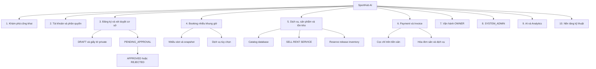
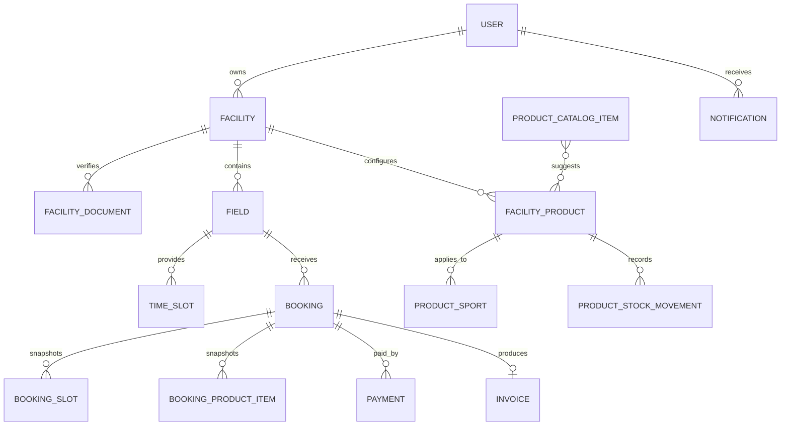

# Phân cấp chức năng SportHub AI

> Phiên bản hiện trạng: **16/08/2026**
> Đối chiếu từ `Backend/app`, `Backend/tests`, `Frontend/src` và router đang hoạt động.

Tài liệu phục vụ tổng hợp báo cáo đồ án. Chức năng chỉ được ghi **Hoàn thành** khi có xử lý backend/database thực tế và giao diện (nếu có) đang gọi API thật.

## 1. Quy ước

| Trạng thái | Ý nghĩa |
|---|---|
| **Hoàn thành** | Có luồng thực tế, phân quyền và dữ liệu thật |
| **Hoàn thành một phần** | Có phần chính nhưng còn thiếu UI/tích hợp cuối |
| **Chưa hoàn thiện** | Placeholder, mock hoặc chưa có backend |
| **Hạ tầng** | Thành phần kỹ thuật phục vụ vận hành/bảo mật |

## 2. Vai trò và phạm vi

Hệ thống có đúng ba vai trò:

| Vai trò | Phạm vi |
|---|---|
| `CUSTOMER` | Tìm sân, đặt sân, chọn dịch vụ, thanh toán và quản lý booking của mình |
| `OWNER` | Đăng ký và vận hành cơ sở, sân, slot, sản phẩm và booking thuộc tenant của mình |
| `SYSTEM_ADMIN` | Quản trị người dùng và xét duyệt hồ sơ đối tác/cơ sở |

Backend lấy danh tính từ JWT, không nhận `owner_id` từ frontend để quyết định quyền. Ownership đi theo `owner → facility → field/product/booking`.

## 3. Sơ đồ phân cấp

## 4. Cây chức năng chi tiết

### 4.1. Khám phá công khai — **Hoàn thành**

1. Trang chủ và danh sách sân lấy dữ liệu backend; hỗ trợ tìm kiếm, lọc, phân trang.
2. Chỉ cơ sở `APPROVED` và sân phù hợp trạng thái mới xuất hiện công khai.
3. Chi tiết hiển thị cơ sở, sân, tiện ích, ảnh, hotline, giờ hoạt động, giá, slot và đánh giá.
4. CUSTOMER thêm/bỏ yêu thích và xem lịch trống kế tiếp.
5. Recommendation dùng lịch sử, rating, giá, khoảng cách và khả dụng.
6. Bản đồ hiện dùng `MapMock`, chưa tích hợp bản đồ thật — **Hoàn thành một phần**.

### 4.2. Tài khoản, xác thực và phân quyền

#### 4.2.1. Xác thực và hồ sơ — **Hoàn thành**

1. Đăng ký public luôn tạo `CUSTOMER`; đăng nhập trả access/refresh token.
2. Refresh kiểm tra loại token, trạng thái tài khoản và phiên; logout xóa token phía frontend.
3. Xem/sửa hồ sơ, đổi mật khẩu và upload avatar có kiểm tra file.
4. Backend hash mật khẩu bằng bcrypt.
5. Quên và đặt lại mật khẩu qua Email (SMTP thật) & Số điện thoại (OTP) với JWT token 15 phút, rate limit chống spam, blacklist token 1 lần, vô hiệu hóa phiên cũ qua `session_version` và trang ResetPassword chuyên biệt — **Hoàn thành**.

#### 4.2.2. Phân quyền — **Hoàn thành**

1. Frontend có auth guard và role guard; backend kiểm tra role tại dependency/service.
2. OWNER chỉ thao tác facility, field, product, booking và payment thuộc mình.
3. CUSTOMER chỉ xem booking/payment/refund của mình.
4. Chỉ SYSTEM_ADMIN được xét duyệt hồ sơ và thao tác quản trị.

#### 4.2.3. Thông báo — **Hoàn thành**

1. Có model/API danh sách, số chưa đọc, đánh dấu một hoặc tất cả đã đọc.
2. Có trang và chuông thông báo; booking/xét duyệt tạo thông báo nghiệp vụ.
3. Email, SMS, push và realtime socket chưa thuộc phạm vi hoàn chỉnh.

### 4.3. Đăng ký OWNER và đăng ký cơ sở

#### 4.3.1. Hồ sơ đăng ký OWNER — **Hoàn thành**

1. CUSTOMER tạo hồ sơ đối tác và giấy tờ pháp lý.
2. Có gửi, rút, bổ sung, đăng ký lại và xem trạng thái.
3. SYSTEM_ADMIN duyệt/yêu cầu bổ sung/từ chối; chỉ duyệt mới cấp role OWNER.

#### 4.3.2. Bản nháp cơ sở — **Hoàn thành**

1. OWNER tạo facility `DRAFT`, lưu dần và tiếp tục chỉnh sửa cùng bản ghi.
2. Chỉ xóa được draft thuộc OWNER hiện tại; backend chặn các trạng thái khác.
3. Xóa draft dọn file chỉ thuộc hồ sơ, không xóa file còn tham chiếu.

#### 4.3.3. Giấy tờ xác minh cơ sở — **Hoàn thành**

1. Hồ sơ gồm thông tin cơ sở, môn, ảnh và giấy tờ: loại, tên, số, ngày/nơi cấp.
2. Hỗ trợ nhiều `JPG/JPEG/PNG/PDF`, tối đa 10 MB/file và giới hạn số file.
3. UI hiển thị tên, dung lượng, preview ảnh, xem PDF và xóa file.
4. Backend kiểm tra MIME thật, hash chống trùng, tên lưu an toàn.
5. File nằm trong vùng private và chỉ trả qua endpoint kiểm tra OWNER/ADMIN.

#### 4.3.4. Xét duyệt cơ sở — **Hoàn thành**

1. `DRAFT → PENDING_APPROVAL → APPROVED | REJECTED`.
2. Hồ sơ thiếu ảnh/giấy tờ không được gửi; hồ sơ chờ duyệt không công khai và không nhận booking.
3. ADMIN xem OWNER, cơ sở, giấy tờ, ngày gửi; reject bắt buộc lý do.
4. OWNER không tự approve; hồ sơ rejected được sửa và gửi lại.
5. Chỉ facility approved mới được tạo/quản lý dữ liệu vận hành.

### 4.4. Booking CUSTOMER

#### 4.4.1. Availability và nhiều khung giờ — **Hoàn thành**

1. Kiểm tra theo sân, ngày và danh sách slot; loại booking đang giữ, field-block và bảo trì.
2. CUSTOMER chọn nhiều slot của cùng sân/ngày trong một booking.
3. Backend kiểm tra từng slot, loại trùng và bảo vệ cạnh tranh đồng thời.
4. `booking_slots` lưu thứ tự, tên, giờ bắt đầu/kết thúc và giá snapshot.
5. Chi tiết, payment và invoice hiển thị đầy đủ từng slot; dữ liệu booking một slot cũ vẫn tương thích.

#### 4.4.2. Chọn dịch vụ — **Hoàn thành**

1. Bước dịch vụ là tùy chọn, chỉ hiện sản phẩm đúng facility/sport, active và khả dụng.
2. SERVICE không theo tồn kho vẫn được chọn khi active.
3. CUSTOMER không được chọn vượt `available_quantity`.
4. Backend không tin giá/subtotal/total frontend; luôn đọc database và tính lại.
5. Booking lưu snapshot tên, loại, đơn vị, số lượng, đơn giá và thành tiền.

#### 4.4.3. Vòng đời booking — **Hoàn thành**

1. Tạo `PENDING_PAYMENT`, giữ slot/sản phẩm trong thời hạn thanh toán.
2. Hỗ trợ xác nhận, từ chối, hủy, bắt đầu, no-show và hoàn thành.
3. `EXPIRED/CANCELLED` giải phóng slot và inventory đang reserve.
4. Reschedule kiểm tra lại slot và sản phẩm liên quan.
5. CUSTOMER xem lịch sử, timeline, payment, sản phẩm và invoice snapshot.
6. CUSTOMER xem danh sách "Khiếu nại của tôi", theo dõi tiến độ xử lý và hủy khiếu nại đang `PENDING`.
7. CUSTOMER đánh giá sân (tab Chờ đánh giá / Đã đánh giá) và hỗ trợ **Chỉnh sửa đánh giá** (cập nhật rating/comment, tính lại rating sân).

### 4.5. Dịch vụ, sản phẩm và tồn kho

#### 4.5.1. Danh mục của cơ sở — **Hoàn thành**

1. Ba loại `SELL`, `RENT`, `SERVICE`.
2. Thuộc tính: tên, loại, mô tả ngắn, giá, đơn vị, trạng thái, số lượng và các môn áp dụng.
3. UI không dùng ảnh sản phẩm theo phạm vi đồ án.
4. OWNER chỉ quản lý sản phẩm thuộc facility của mình; có thêm, sửa, bật/tắt, hết hàng và lưu trữ mềm.
5. Sản phẩm đã xuất hiện trong booking/invoice không bị hard delete.

#### 4.5.2. Catalog mặc định — **Hoàn thành**

1. Catalog nằm trong database, không hard-code trực tiếp trong modal frontend.
2. Seed 47 mục cho Bóng đá/Futsal, Cầu lông, Pickleball, Tennis, Bóng rổ, Bóng chuyền, Bóng bàn và dùng chung.
3. Seed dùng cơ chế seed chung, idempotent theo `catalog_key`.
4. Catalog chỉ là gợi ý, không tự gán cho mọi facility.
5. OWNER chọn một/nhiều mục rồi chỉnh giá, số lượng, đơn vị, trạng thái và môn.
6. Import mặc định `INACTIVE`, giá 0, số lượng 0; import lặp không tạo trùng.

#### 4.5.3. Cấu hình ngay tại sân — **Hoàn thành**

1. Card `/management/courts` có nút `Dịch vụ` và tự nhận facility/sport của sân.
2. Cấu hình dùng chung theo `facility + sport`, tránh nhập lặp cho các court cùng môn.
3. Modal hiển thị dịch vụ đang áp dụng, catalog theo môn và dịch vụ dùng chung.
4. OWNER chọn/bỏ chọn, sửa giá/số lượng/đơn vị, bật/tắt, hết hàng hoặc thêm riêng.
5. Bỏ chọn chỉ gỡ môn hiện tại; nếu là môn cuối cùng thì chuyển `ARCHIVED`.
6. Dữ liệu đồng bộ với `/management/products` và modal `+ Dịch vụ` trong booking.

#### 4.5.4. Inventory — **Hoàn thành**

1. `available_quantity = stock_quantity - reserved_quantity`; không cho số lượng âm.
2. `SELL` reserve khi chờ thanh toán và giảm tồn chính thức ở giao dịch phù hợp.
3. `RENT` giữ trong thời gian booking và trả khả dụng khi hủy/kết thúc.
4. `SERVICE` mặc định không theo tồn kho nhưng có thể bật theo dõi.
5. Lịch sử gồm `IMPORT`, `SALE`, `RESERVE`, `RETURN`, `RELEASE`, `ADJUSTMENT`.
6. Backend bảo vệ trường hợp hai CUSTOMER cùng lấy sản phẩm cuối cùng.

#### 4.5.5. Dịch vụ phát sinh — **Hoàn thành**

1. OWNER bấm `+ Dịch vụ` trong booking đang phù hợp trạng thái.
2. API trả đúng OWNER/facility/sport; hàng hết hiển thị nhưng không chọn được.
3. Có thêm, sửa số lượng hoặc xóa BookingItem theo trạng thái booking.
4. Cập nhật `service_amount`, `total_amount`, `remaining_amount` nhưng không đổi khoản cọc đã trả.
5. CUSTOMER thấy phát sinh trong chi tiết và hóa đơn.

### 4.6. Payment, đặt cọc và Invoice — **Hoàn thành**

1. `court_amount` là tổng giá snapshot các slot; `service_amount` là tổng BookingItem.
2. `total_amount = court_amount + service_amount`.
3. `deposit_amount` chỉ tính trên `court_amount`; QR cọc dùng đúng giá trị này.
4. `remaining_amount = total_amount - paid_amount`, bao gồm dịch vụ phát sinh.
5. Payment hỗ trợ cọc/phần còn lại, bank intent, QR, lịch sử, summary và demo mode có kiểm soát.
6. Invoice hiển thị nhiều slot, tiền sân, từng sản phẩm, số lượng, đơn giá, thành tiền, cọc, còn lại và tổng cộng.
7. OWNER đổi giá/đơn vị sau này không làm thay đổi booking và hóa đơn cũ.
8. Hoàn tiền hỗ trợ yêu cầu, xác nhận đã hoàn/đã nhận, tranh chấp và quá hạn.

### 4.7. Vận hành OWNER

1. Cơ sở: thông tin, hotline, giờ hoạt động, ảnh và chính sách hủy — **Hoàn thành**.
2. Sân: cơ sở, môn, giá, tiện ích và trạng thái `available/maintenance/inactive` — **Hoàn thành**.
3. Slot: CRUD, bật/tắt, giá weekday/weekend và bảo vệ lịch sử — **Hoàn thành**.
4. Booking tenant: xác nhận, từ chối, hủy, bắt đầu, no-show, hoàn thành — **Hoàn thành**.
5. Bảo trì: lịch, trạng thái, chi phí và booking ảnh hưởng — **Hoàn thành**.
6. Khách hàng, khiếu nại, đánh giá và phản hồi — **Hoàn thành**.
7. Dashboard/analytics: doanh thu sân, dịch vụ, tổng doanh thu, hiệu suất sân/slot và sản phẩm dùng nhiều — **Hoàn thành**.
8. API field-block đã có nhưng trang chuyên biệt còn hạn chế — **Hoàn thành một phần**.
9. Audit log có backend/API, chưa có trang riêng — **Hoàn thành một phần**.

### 4.8. SYSTEM_ADMIN

1. Dashboard tổng hợp user, OWNER, CUSTOMER, facility và hồ sơ chờ duyệt — **Hoàn thành**.
2. Tìm kiếm/lọc user, khóa/mở khóa và chặn tự khóa admin hiện tại — **Hoàn thành**.
3. Xét duyệt hồ sơ đăng ký OWNER — **Hoàn thành**.
4. `Quản trị hệ thống → Xét duyệt cơ sở`: xem hồ sơ và file private, approve/reject — **Hoàn thành**.
5. Reject bắt buộc lý do và kết quả tạo thông báo cho OWNER — **Hoàn thành**.
6. API facility toàn hệ thống đã có; UI quản trị tổng hợp còn giới hạn — **Hoàn thành một phần**.
7. Admin được tạo bằng CLI/environment, không có API tự nâng quyền công khai — **Hoàn thành**.

### 4.9. AI, recommendation và analytics

1. Assistant phân loại intent, trích entity, giữ context và giới hạn domain — **Hoàn thành**.
2. Truy vấn riêng tư áp dụng JWT/tenant scope tại service và repository — **Hoàn thành**.
3. Assistant không tự mutation booking/payment, chỉ hướng dẫn — **Hoàn thành**.
4. Thông tin sản phẩm, giá và số lượng đọc từ backend hiện tại — **Hoàn thành**.
5. Recommendation dùng lịch sử, rating, khoảng cách, giá và availability — **Hoàn thành**.
6. Pipeline ML offline, metrics, dự báo nhu cầu và recommendation OWNER — **Hoàn thành**.
7. LLM ngoài phụ thuộc cấu hình runtime và có fallback an toàn — **Hoàn thành một phần**.

### 4.10. Nền tảng, dữ liệu và bảo mật — **Hạ tầng**

1. FastAPI, Pydantic, OpenAPI/Swagger và health endpoint.
2. React 19, TypeScript, Vite, React Router, Tailwind và Lucide.
3. SQLAlchemy; SQLite local và PostgreSQL production; startup migration.
4. JWT access/refresh, bcrypt, CORS theo environment và session version.
5. File private, tên lưu an toàn, MIME/hash và endpoint có quyền.
6. Seed demo idempotent, cấu hình qua environment và advisory lock PostgreSQL.
7. Catalog seed ngay cả khi tắt tài khoản demo; không tự tạo FacilityProduct cho OWNER.
8. Audit log cho mutation nghiệp vụ quan trọng.

## 5. Mô hình dữ liệu trọng tâm

## 6. Ma trận phân quyền

| Nghiệp vụ | CUSTOMER | OWNER | SYSTEM_ADMIN |
|---|:---:|:---:|:---:|
| Xem sân công khai | Có | Có | Có |
| Tạo booking | Có | Không theo luồng CUSTOMER | Không |
| Chọn dịch vụ | Có | Thêm phát sinh | Không |
| Tạo facility | Không | Có | Không |
| Xóa draft facility | Không | Chỉ draft của mình | Không |
| Quản lý product/inventory | Không | Chỉ facility của mình | Không |
| Approve/reject facility | Không | Không | Có |
| Xem giấy tờ facility | Không | Chỉ facility của mình | Có |
| Quản trị user | Không | Không | Có |

## 7. Giới hạn còn lại

1. Quên/đặt lại mật khẩu qua email chưa hoàn chỉnh.
2. Chưa tích hợp bản đồ thật.
3. Email/SMS/push/realtime notification chưa hoàn chỉnh.
4. UI riêng cho toàn bộ API field-block chưa đầy đủ.
5. UI audit log và quản trị facility toàn hệ thống còn giới hạn.
6. LLM bên ngoài phụ thuộc cấu hình runtime; assistant duy trì fallback an toàn.

## 8. Căn cứ kiểm thử gần nhất

- Product/Inventory/Booking/Payment/Invoice: **21/21 test đạt** ngày 16/08/2026.
- Có test seed/import chống trùng, tenant isolation và OWNER/CUSTOMER permissions.
- Có test hai CUSTOMER cạnh tranh sản phẩm cuối cùng.
- Có test reserve/release, expired/cancelled, SELL/RENT/SERVICE và invoice snapshot.
- Có test deposit chỉ tính tiền sân và thay giá không ảnh hưởng booking cũ.
- Có test lọc cấu hình theo môn sân và bỏ môn không ảnh hưởng môn khác.
- Frontend TypeScript và Vite production build thành công.

## 9. Quy tắc cập nhật

Khi chức năng thay đổi, cập nhật đồng thời file này, [`Chucnang.md`](Chucnang.md), [`API.md`](API.md) và README nếu có thay đổi route, vai trò hoặc trạng thái hoàn thiện.
